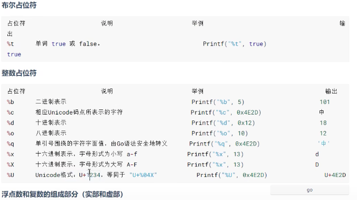
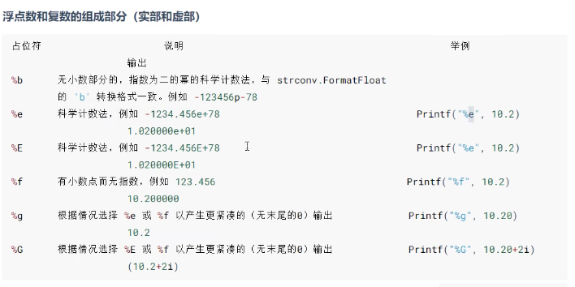

#### Go 语言

##### Go入门及基础指令

- 常用指令

  - 运行文件

    ```go
    go run index.go
    ```

  - 编译文件

    ```go
    go build index.go  // 生成一个二进制的可执行文件
    ```

  - 格式化代码

    ```go
    gofmt index.go // 只是将格式化的代码输出
    gofmt -w index.go // 格式化代码并写入文件
    ```

  - 查看数据的类型

    ```go
    var n = 100
    fmt.Printf("n的类型%T",n) // 输出类型
    fmt.Printf("n的类型%c",n) // 格式化输出
    fmt.Printf("n的类型%d",n) // 输出码值
    ```

    

  - 123

- 变量类型及默认值

  - 声明变量

    ```go
    package main
    import  "fmt"
    
    import ( // 引入多个
    	"fmt",
    )
    var ( // 一次性声明， 此处为全局变量
    	m1 = 1
      m2 = 2
      m3 = 3
    )
    func main(){
      var i int
      num := 20 // 可使用 := 赋值，（仅限变量未声明时）
      var n1,n2,n3 int = 1,2,3 // 声明多个变量
      i = 10;
      fmt.Println("i=",i) // 打印
      fmt.Printf("i的类型 %T",i) // 输出数据类型
    }
    ```

  - `int`类型，默认值是0

    ````go
    var i int;
    i = 10
    ````

  - 111

- 123

##### 数据类型

- 基本数据类型

  - 整数的类型

    - int8     有符号  占用1字节  范围（-128～127）
    - int16   有符号  占用2字节  范围（-2^15^～2^15^-1）
    - int32   有符号  占用4字节  范围（-2^31^～2^31^-1）
    - int64   有符号  占用8字节  范围（-2^63^～2^63^-1）

    - unit8   无符号  占用1字节    范围（0～255）
    - unit16 无符号  占用2字节    范围（0～2^16^-1）
    - unit32 无符号  占用4字节    范围（0～2^32^-1）
    - unit64 无符号  占用8字节    范围（0～2^64^-1）
    - int  有符号  32（64）位系统4（8）字节  范围 -2^31^~2^31^-1（-2^63^~2^63^-1）
    - uint  无符号  32（64）位系统4（8）字节  范围 0~2^32^-1（0~2^64^-1）
    - rune  有符号  与int32一样  范围 -2^31^~2^31^-1  等价int32，表示一个Unicode码
    - byte  无符号  与unit8一样  范围 0~255  当要存储字符时选用byte

  - 浮点类型

    - 浮点数都是有符号的
    - `float32`  单精度  `float64` 双精度（推荐使用float64）

  - `string`类型，默认为空字符串

    - go的字符串由字节组成

      ```go
      var a string = "北\n京"  // 双引号会识别转义字符
      var b string = `北\n京`  // 反引号不会识别转义字符，原样输出
      ```

  - 基本数据类型的默认值（go语言中每个数据类型都有一个默认值（也叫零值））

    ```go
    var a int
    var b float32
    fmt.Printf("%v",a)  // %v按照原始值输出
    ```

  - go在不同类型的变量之间赋值时需要显示转换

    ```go
    // 被转换的是变量存储的数据，变量本身的数据类型并没有发生变化。
    var i int32 = 100
    var n1 float32 = float32(i)  // 转换类型
    ```

  - 如果没有用到一个包，可加_忽略

    ```go
    import (
    	_ "fmt" // 忽略此包
    )
    ```

    

  - 1

- 派生/复杂数据类型

#### 包的概念

- 初始化包

  ```go
  // 会在文件目录下创建go.mod文件，引入自定义包是从该目录开始
  go mod init test
  ```

- 1

### 常用方法的封装

- 文件读写

  ```go
  package main
  
  import (
  	"fmt"
  	"os"
  	"bufio"
  	"io"
  )
  
  func main() {
  	srcFile := "./111.txt"
  	dstFile := "./test/222.txt"
  	CopyFile(srcFile, dstFile)
  }
  
  func CopyFile(srcFileName string, dstFileName string) (written int64,err error) {
  	srcFile,err := os.Open(srcFileName)
  	if err != nil {
  		fmt.Println(err)
  	}
  	defer srcFile.Close()
  	reader := bufio.NewReader(srcFile)
  	dstFile,errDst := os.OpenFile(dstFileName, os.O_WRONLY | os.O_CREATE, 0666)
  	if errDst != nil {
  		fmt.Println(errDst)
  		return
  	}
  	defer dstFile.Close()
  	writer := bufio.NewWriter(dstFile)
  	return io.Copy(writer,reader)  
  }
  ```

  

- 2

### 常用的数组方法

- 数组的排序

  - `int` 类型

    ```go
    arr := []int{1,3,2,5,4}
    sort.Ints(arr) // [1,2,3,4,5]
    ```

  - 111

- 删除数组中某个值

  ```go
  i := 2
  nums := []int{1,2,3,4,5,6}
  nums = append(nums[:i], nums[i+1:]...) // [1,2,4,5,6]
  ```

- 数组的复制

  ```go
  nums := []int{1,2,3,4,5}
  nums = append(nums,0)
  copy(nums[1:], nums) // [1,1,2,3,4,5]
  ```

- 11

### 数据库连接

- 注意事项

  - 初始化mod

    ```go
    go mod init server
    ```

  - 下载 `gin` 框架和 `mysql` 库

    ```go
    // 下载gin
    go get -u github.com/gin-gonic/gin
    // 下载mysql
    go get -u github.com/go-sql-driver/mysql
    ```

    

- 连接mysql数据库

  ```go
  // utils/db.go
  package utils
  
  import (
  	"database/sql"
  	"fmt"
  
  	_ "github.com/go-sql-driver/mysql"
  )
  
  func DbConnect() *sql.DB {
  	db, err := sql.Open("mysql", "root:password@(localhost:3306)/database")
  	db.SetMaxOpenConns(10)
  	db.SetMaxIdleConns(5)
  	if err != nil {
  		panic(err)
  	}
  	if err := db.Ping(); err != nil {
  		fmt.Println("连接失败")
  		panic(err.Error())
  	}
  	fmt.Println("连接成功")
  	return db
  }
  ```

- 建立连接并查询

  ```go
  // routers/router.go
  package routers
  
  import (
  	"database/sql"
  	"fmt"
  	"log"
  	"net/http"
  	"server/utils"
  
  	"github.com/gin-gonic/gin"
  )
  
  var (
  	Db *sql.DB
  )
  
  type User struct {
  	Id       string `json:"id" form:"id"`
  	Username string `json:"username" form:"username"`
  	Age      string `json:"age" form:"age"`
  	Sex      string `json:"sex" form:"sex"`
  }
  
  // 中间件
  func MiddleWare() gin.HandlerFunc {
  	return func(c *gin.Context) {
  		fmt.Println("中间件执行完毕")
  		c.Next()
  	}
  }
  
  // 总路由
  func SetupRouter() *gin.Engine {
  	Db = utils.DbConnect()
  	// defer Db.Close()
  	r := gin.Default()
  	r.Use(MiddleWare())
  	user := r.Group("/user")
  	{
  		user.GET("/list", UserHandler)
  	}
  	return r
  }
  
  // user路由
  func UserHandler(c *gin.Context) {
  	var user User
  	userList := make([]User, 0)
  	rows, err := Db.Query("select * from articles")
  	defer rows.Close()
  	if err != nil {
  		log.Fatal(err)
  	}
  	i := 0
    for rows.Next() { //循环显示所有的数据(顺序与数据库顺序一致)
  		rows.Scan(&user.Id, &user.Username, &user.Age, &user.Sex)
  		userList = append(userList, user)
  		i++
  	}
  	c.JSON(http.StatusOK, gin.H{
  		"code": 0,
  		"msg":  "请求成功",
  		"data": &userList,
  	})
  }
  ```

- 入口文件初始化

  ```go
  // main.go
  package main
  
  import (
  	"server/routers"
  )
  
  func main() {
  	r := routers.SetupRouter()
  	r.Run(":88")
  }
  ```


## go语言基础

### 字符串方法

- 字符串拼接

  ```go
  package main
  import (
  	"strings"
    "bytes"
  )
  func main() {
    // 第一种
    name := "111"
    age := "22"
    result := strings.Join([]string{name,age},",")
    fmt.Printf("result: %v\n",result)
    
    // 第二种
    var buffer bytes.Buffer
    buffer.WriteString("tom")
    buffer.WriteString("=")
    buffer.WriteString("20")
    fmt.Printf("buffer.String():%v\n",buffer.String())
  }
  ```

- 字符串的切片

  ```go
  s := "Hello world"
  a := 2
  b := 5
  
  fmt.Printf("s[a]:%v\n",s[a])
  fmt.Printf("s[a:b]:%v\n",s[a:b])
  fmt.Printf("s[a:]:%v\n",s[a:])
  fmt.Printf("s[:b]:%v\n",s[:b])
  ```

- 字符串的其他常用

  长度 `len(str)` 

  分割 `strings.Split(str,",")`

  是否包含某个字符串 `strings.Contains(str,"hello")`

  大小写 `strings.ToLower(str) `  `string.ToUpper(str)`

  是否含有前后缀

   `string.HasPrefix("hello")`  `strings.HasSuffix("hello")`

  查找索引 `strings.Index(s,"ll")` `strings.LastIndex(s,"ll")`

- 输出字符

  

  

- 获取终端输入值

  ```go
  package main
  
  import (
  	"fmt"
  )
  
  func main() {
  	var (
  		name string
  		age  int
  	)
  	fmt.Println("请输入姓名和年龄，用空格分隔：")
  	fmt.Scan(&name, &age) // 获取终端输入
  	fmt.Printf("name: %v\n", name)
  	fmt.Printf("age: %v\n", age)
  }  
  ```

### 流程条件语句

- 流程语句

  ```go
  switch grade {
    case "A", "D": // case中可有多个值
    	fmt.Println("A or D")
    	fallthrough // 可继续执行下一个case
    case "B":
    	fmt.Println("B")
    case "C":
    	fmt.Println("C")
    default:
    	fmt.Println("以上都不是")
  }
  
  // switch后可不加条件，则默认为true
  switch {
    case grade == "A":
      fmt.Println("A")
    case grade == "B":
    	fmt.Println("B")
    default:
    	fmt.Println("都不是")
  }
  ```

- for和for range循环

  ```go
  ///////// for循环
  // for循环中可以通过break、goto、return、panic语句强制退出循环。
  // 常用写法
  for i := 1; i < 10; i++ {
    fmt.Printf("i: %v\n", i)
  }
  
  // 第一个条件可写在外边
  i := 1
  for ; i < 10; i++ {
    fmt.Printf("i: %v\n", i)
  }
  
  // 初始条件可省略，放在for循环外边
  i := 1
  for i < 10 {
    fmt.Printf("i: %v\n", i)
    i++
  }
  
  // 永真循环，类似于while循环
  for {
    fmt.Println("一直在执行")
  }
  
  ///////for range循环
  // 可以遍历数组、切片、字符串、map以及通道（channel）
  // 1.数组、切片、字符串返回索引和值。
  // 2.map返回值和值。
  // 3.通道（channel）只返回通道内的值。
  
  // 常用写法
  var list = [5]int{1, 2, 3, 4, 5} // 数组
  for i, v := range list {
    fmt.Printf("v: %v:%v\n", i, v)
  }
  
  // 遍历切片
  var list = []int{1, 2, 3} // 切片（动态的数组）
  for _, v := range list { // 省略时用下划线代替
    fmt.Printf("v: %v\n", v)
  }
  
  // 遍历map
  m := make(map[string]string, 0) // map[key的类型]value的类型
  m["name"] = "测试"
  m["address"] = "北京"
  for key, value := range m {
    fmt.Printf("v: %v:%v\n", key, value)
  }
  ```

- `break` 可以结束 `for`、`switch`、 `select` 的代码块

  ```go
  switch grade {
    case "A", "D": // case中可有多个值
    	fmt.Println("A or D")
    	break // 可就此中断switch，下面的fallthrough将不执行
    	fallthrough 
    case "B":
    	fmt.Println("B")
    case "C":
    	fmt.Println("C")
    default:
    	fmt.Println("以上都不是")
  }
  
  // 跳出到指定位置
  label: // 定义标签
  	for i := 1; i < 5; i++ {
  		fmt.Printf("i: %v\n", i)
  		if i == 3 {
  			break label // 跳到标签处
  		}
  	}
  ```

- `continue` 

  ```go
  for i := 1; i < 5; i++ {
    if i == 3 {
      fmt.Printf("i: %v\n", i)
    } else {
      continue // 当前循环结束，进行下一次循环
    }
  }
  
  for i := 1; i < 5; i++ {
  	label:
  		for j := 1; j < 6; j++ {
  			if i == 3 && j == 3 {
  				continue label // 跳到指定标签，后续不执行
  			}
  			fmt.Printf("i,j: %v,%v\n", i, j) // 此处在i j == 3时不执行
  		}
  	}
  ```

- `goto`

  ```go
  i := 1
  if i >= 2 {
    fmt.Printf("i: %v\n", i)
  } else {
    goto label // 跳到标签处
  }
  label:
  	fmt.Println("结束了")
  
  // 也可以跳出双重循环
  ```

### 数组

- 基本定义、初始化

  ```go
  var arr [1]int // [长度]类型
  
  // 初始化列表
  var arr1 = [3]int{1,2,3}
  var arr2 = [3]string{"1","2"} // 无值时默认为空，int无值默认为0
  
  // 省略长度
  var arr3 = [...]int{1,2,3,4,5}
  fmt.Printf("len: %v",len(arr3))
  
  var arr4 = [...]bool{2:true,5:false}
  ```

- 修改数组

  ```go
  var arr = [...]int{1,2,3}
  arr[0] = 100 // 通过下标进行访问或者修改
  
  var arr1 [2]int // 定义好的数组长度不能越界
  a[0] = 100
  a[2] = 200
  
  // 数组的长度
  var arr2 = [3]int{1,2,3}
  fmt.Println(len(arr2))
  ```

- 数组的遍历

  ```go
  var arr = [3]int{1, 2, 3}
  for i := 0; i < len(arr); i++ {
    fmt.Printf("i: %v\n", arr[i])
  }
  
  // for range的方式遍历
  var arr1 = [3]int{1, 2, 3}
  for _, v := range arr1 {
    fmt.Printf("v: %v\n", v)
  }
  ```

### 切片

- 创建切片

  ```go
  // 申明切片
  var identifier []type
  var arr []int
  var arr1 []string
  
  // 切片是引用类型，可使用make来创建切片
  var ss = make([]int,2) // 第二个参数为切片的容量
  ```

- 数组/切片常用

  ```go
  var s1 = []int{1, 2, 3}
  fmt.Printf("len(s1): %v\n", len(s1)) // 切片长度
  fmt.Printf("cap(s1): %v\n", cap(s1)) // 切片容量
  
  // 取值 / 数组同样适用
  var arr = []int{1, 2, 3, 4, 5, 6}
  var s1 = arr[0:3] // [) 取0-3位 第二位为开区间
  var s2 = arr[3:] // 取3到最后
  var s3 = arr[:] // 取所有元素
  fmt.Printf("s1: %v\n", s1)
  fmt.Printf("s2: %v\n", s2)
  fmt.Printf("s3: %v\n", s3)
  
  // 切片遍历（也可以通过for range的方式遍历）
  var arr = []int{1, 2, 3, 4, 5, 6}
  for i := 0; i < len(arr); i++ {
    fmt.Printf("arr[%v]: %v\n", i, arr[i])
  }
  ```

- 切片操作

  ```go
  // 切片添加
  var s1 = []int{}
  s1 = append(s1, 1)
  s1 = append(s1, 2)
  s1 = append(s1, 3)
  fmt.Printf("s1: %v\n", s1)
  
  var s1 = []int{}
  var s2 = []int{1, 2, 3, 4, 5}
  s1 = append(s1, s2[3:]...) // 将s2索引为3后的元素添加进s1，其中...表示展开
  fmt.Printf("s1: %v\n", s1)
  
  // 切片删除元素
  // a = append(a[:index],a[index+1]...) // 删除某个索引
  var s1 = []int{1, 2, 3, 4, 5}
  s1 = append(s1[:2], s1[3:]...) // 删除索引为2的元素
  fmt.Printf("s1: %v\n", s1) // =>>> [1,2,4,5]
  
  // 修改
  var s1 = []int{1, 2, 3, 4, 5}
  s1[3] = 100 // 传入需要修改的索引
  fmt.Printf("s1: %v\n", s1)
  
  // 查找
  var s1 = []int{1, 2, 3, 4, 5}
  var key = 2
  for i, v := range s1 {
    if key == v {
      fmt.Printf("i: %v\n", i) // 找到该值对应的索引
    }
  }
  
  // 拷贝切片
  var s1 = []int{1,2,3,4}
  s2 := s1 // 直接赋值时内存地址一样，修改s2会导致s1也被修改
  
  var s1 = []int{1, 2, 3, 4, 5}
  var s2 = make([]int, 5) // 需要make
  copy(s2, s1) // 将s1切片复制到s2
  s2[3] = 100
  fmt.Printf("s1: %v\n", s1) // =>>> [1,2,3,4,5]
  fmt.Printf("s2: %v\n", s2) // =>>> [1,2,3,100,5]
  ```

### map

- 语法格式

  ```go
  // 创建map
  var m1 = make(map[string]string)
  m1["name"] = "测试"
  m1["address"] = "beijing"
  fmt.Printf("m1: %v\n", m1)
  
  var m1 map[string]string // 声明
  m1 = make(map[string]string)
  m1["name"] = "测试"
  m1["address"] = "beijing"
  fmt.Printf("m1: %v\n", m1)
  ```

- 初始化map

  ```go
  // 创建时可直接初始化
  var m1 = map[string]string{"name": "测试", "age": "20"}
  fmt.Printf("m1: %v\n", m1)
  
  // 动态赋值
  m1 := make(map[string]string)
  m1["name"] = "测试"
  m1["address"] = "beijing"
  fmt.Printf("m1: %v\n", m1)
  ```

- map操作

  ```go
  // 通过key访问
  var m1 = map[string]string{"name": "测试", "age": "20"}
  var key = "name"
  var value = m1[key]
  fmt.Printf("value: %v\n", value)
  
  // 通过返回值判断
  var m1 = map[string]string{"name": "测试", "age": "20"}
  var key = "name"
  v, ok := m1[key] // 存在时ok为true,不存在为false
  fmt.Printf("v: %v:%v\n", v, ok) // =>>> v:测试 true
  ```

- map遍历

  ```go
  m1 := map[string]string{"name": "测试", "age": "11"}
  for k := range m1 { // 只获取map的key
    fmt.Printf("k: %v\n", k)
  }
  
  m1 := map[string]string{"name": "测试", "age": "11"}
  for k, v := range m1 { // 同时获取key和value
    fmt.Printf("k-v: %v-%v\n", k, v)
  }
  ```

### 函数

- 介绍

  - 普通函数
  - 匿名函数（没有名称的函数）
  - 方法（定义在struct上的函数）

- 不允许函数重载，也就是说不允许函数同名

- 函数不能嵌套函数，但可以嵌套匿名函数

- 函数参数

  ```go
  // 返回值可以有参数，也可以没参数
  func fn1(a int, b int) (res int) { // 返回值
    res = a + b
  	return res
  }
  
  func fn1(){
    return 2
  }
  
  func fn1(a int, b int) int { // 返回值可以匿名
  	return a + b
  }
  
  func main() {
  	result := fn1(1, 2)
  	fmt.Printf("result: %v\n", result)
  }
  
  // 多个返回值
  func fn1() (name string, age int) {
  	return "测试", 12
  }
  func main() {
  	result1, result2 := fn1()
  	fmt.Printf("result1: %v\n", result1)
  	fmt.Printf("result2: %v\n", result2)
  }
  
  // map slice interface channel这些类型的底层是指针类型，拷贝传值后可能会影响外部数据结构的值
  
  // 可变参数
  func fn1(args ...int) { // 使用... 
  	for _, v := range args {
  		fmt.Printf("v: %v\n", v)
  	}
  }
  func main() {
  	fn1(1, 2, 3, 4, 5)
  }
  
  // 指定参数 + 可变参数
  func fn1(name string, age int, args ...int) {
  	fmt.Printf("name: %v\n", name)
  	fmt.Printf("age: %v\n", age)
  	for _, v := range args {
  		fmt.Printf("v: %v\n", v)
  	}
  }
  func main() {
  	fn1("测试", 20, 1, 2, 3, 4, 5)
  }
  ```

- 可定义函数类型

  ```go
  // 符合这种类型的函数都可以进行赋值
  type fun func(int, int) int
  
  func fn1(a int, b int) int {
  	return a + b
  }
  func main() {
  	var f1 fun
  	f1 = fn1
  	r := f1(4, 5)
  	fmt.Printf("r: %v\n", r)
  }
  ```

- 高阶函数

  ```go
  // 函数作为参数
  func fn1(name string) {
  	fmt.Printf("name: %v\n", name)
  }
  
  func test(name string, f func(string)) { // 此处函数作为test函数的参数
  	f(name)
  }
  func main() {
  	test("测试", fn1)
  }
  
  // 返回值为函数
  func add(a int, b int) int {
  	return a + b
  }
  func plus(a int, b int) int {
  	return a - b
  }
  
  func test(types string) func(int, int) int {
  	if types == "-" {
  		return plus
  	} else {
  		return add
  	}
  }
  
  func main() {
  	fn := test("-")
  	res := fn(2, 1)
  	fmt.Printf("res: %v\n", res)
  }
  ```

  

- 111
