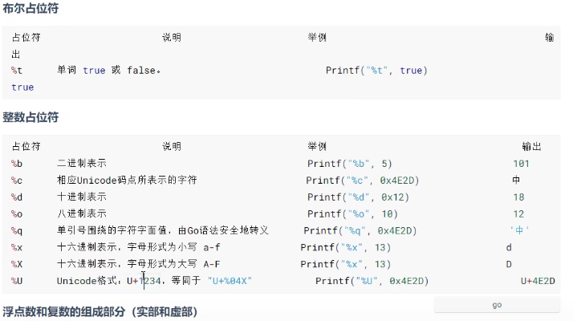
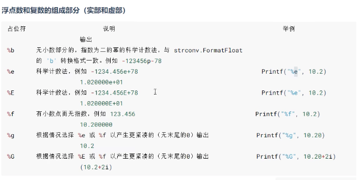

## Go 语言

### Go入门及基础指令

- 常用指令

  - 运行文件

    ```go
    go run index.go
    ```

  - 编译文件

    ```go
    go build index.go  // 生成一个二进制的可执行文件
    ```

  - 格式化代码

    ```go
    gofmt index.go // 只是将格式化的代码输出
    gofmt -w index.go // 格式化代码并写入文件
    ```

  - 查看数据的类型

    ```go
    var n = 100
    fmt.Printf("n的类型%T",n) // 输出类型
    fmt.Printf("n的类型%c",n) // 格式化输出
    fmt.Printf("n的类型%d",n) // 输出码值
    ```

  - 123

- 变量类型及默认值

  - 声明变量

    ```go
    package main
    import  "fmt"
    
    import ( // 引入多个
    	"fmt",
    )
    var ( // 一次性声明， 此处为全局变量
    	m1 = 1
      m2 = 2
      m3 = 3
    )
    func main(){
      var i int
      num := 20 // 可使用 := 赋值，（仅限变量未声明时）
      var n1,n2,n3 int = 1,2,3 // 声明多个变量
      i = 10;
      fmt.Println("i=",i) // 打印
      fmt.Printf("i的类型 %T",i) // 输出数据类型
    }
    ```

  - `int`类型，默认值是0

    ````go
    var i int;
    i = 10
    ````

  - 111


### 数据类型

- 基本数据类型

  - 整数的类型

    - int8     有符号  占用1字节  范围（-128～127）
    - int16   有符号  占用2字节  范围（-2^15^～2^15^-1）
    - int32   有符号  占用4字节  范围（-2^31^～2^31^-1）
    - int64   有符号  占用8字节  范围（-2^63^～2^63^-1）

    - unit8   无符号  占用1字节    范围（0～255）
    - unit16 无符号  占用2字节    范围（0～2^16^-1）
    - unit32 无符号  占用4字节    范围（0～2^32^-1）
    - unit64 无符号  占用8字节    范围（0～2^64^-1）
    - int  有符号  32（64）位系统4（8）字节  范围 -2^31^~2^31^-1（-2^63^~2^63^-1）
    - uint  无符号  32（64）位系统4（8）字节  范围 0~2^32^-1（0~2^64^-1）
    - rune  有符号  与int32一样  范围 -2^31^~2^31^-1  等价int32，表示一个Unicode码
    - byte  无符号  与unit8一样  范围 0~255  当要存储字符时选用byte

  - 浮点类型

    - 浮点数都是有符号的
    - `float32`  单精度  `float64` 双精度（推荐使用float64）

  - `string`类型，默认为空字符串

    - go的字符串由字节组成

      ```go
      var a string = "北\n京"  // 双引号会识别转义字符
      var b string = `北\n京`  // 反引号不会识别转义字符，原样输出
      ```

  - 基本数据类型的默认值（go语言中每个数据类型都有一个默认值（也叫零值））

    ```go
    var a int
    var b float32
    fmt.Printf("%v",a)  // %v按照原始值输出
    ```

  - go在不同类型的变量之间赋值时需要显示转换

    ```go
    // 被转换的是变量存储的数据，变量本身的数据类型并没有发生变化。
    var i int32 = 100
    var n1 float32 = float32(i)  // 转换类型
    ```

  - 如果没有用到一个包，可加_忽略

    ```go
    import (
    	_ "fmt" // 忽略此包
    )
    ```

  - 1

- 派生/复杂数据类型

### 包的概念

- 初始化包

  ```go
  // 会在文件目录下创建go.mod文件，引入自定义包是从该目录开始
  go mod init test
  ```

- 1

### 常用方法的封装

- 文件读写

  ```go
  package main
  
  import (
  	"fmt"
  	"os"
  	"bufio"
  	"io"
  )
  
  func main() {
  	srcFile := "./111.txt"
  	dstFile := "./test/222.txt"
  	CopyFile(srcFile, dstFile)
  }
  
  func CopyFile(srcFileName string, dstFileName string) (written int64,err error) {
  	srcFile,err := os.Open(srcFileName)
  	if err != nil {
  		fmt.Println(err)
  	}
  	defer srcFile.Close()
  	reader := bufio.NewReader(srcFile)
  	dstFile,errDst := os.OpenFile(dstFileName, os.O_WRONLY | os.O_CREATE, 0666)
  	if errDst != nil {
  		fmt.Println(errDst)
  		return
  	}
  	defer dstFile.Close()
  	writer := bufio.NewWriter(dstFile)
  	return io.Copy(writer,reader)  
  }
  ```

- 2

### 常用的数组方法

- 数组的排序

  - `int` 类型

    ```go
    arr := []int{1,3,2,5,4}
    sort.Ints(arr) // [1,2,3,4,5]
    ```

  - 111

- 删除数组中某个值

  ```go
  i := 2
  nums := []int{1,2,3,4,5,6}
  nums = append(nums[:i], nums[i+1:]...) // [1,2,4,5,6]
  ```

- 数组的复制

  ```go
  nums := []int{1,2,3,4,5}
  nums = append(nums,0)
  copy(nums[1:], nums) // [1,1,2,3,4,5]
  ```

- 11

### 字符串方法

- 字符串拼接

  ```go
  package main
  import (
  	"strings"
    "bytes"
  )
  func main() {
    // 第一种
    name := "111"
    age := "22"
    result := strings.Join([]string{name,age},",")
    fmt.Printf("result: %v\n",result)
    
    // 第二种
    var buffer bytes.Buffer
    buffer.WriteString("tom")
    buffer.WriteString("=")
    buffer.WriteString("20")
    fmt.Printf("buffer.String():%v\n",buffer.String())
  }
  ```

- 字符串的切片

  ```go
  s := "Hello world"
  a := 2
  b := 5
  
  fmt.Printf("s[a]:%v\n",s[a])
  fmt.Printf("s[a:b]:%v\n",s[a:b])
  fmt.Printf("s[a:]:%v\n",s[a:])
  fmt.Printf("s[:b]:%v\n",s[:b])
  ```

- 字符串的其他常用

  长度 `len(str)` 

  分割 `strings.Split(str,",")`

  是否包含某个字符串 `strings.Contains(str,"hello")`

  大小写 `strings.ToLower(str) `  `string.ToUpper(str)`

  是否含有前后缀

   `string.HasPrefix("hello")`  `strings.HasSuffix("hello")`

  查找索引 `strings.Index(s,"ll")` `strings.LastIndex(s,"ll")`

- 输出字符

  

  

- 获取终端输入值

  ```go
  package main
  
  import (
  	"fmt"
  )
  
  func main() {
  	var (
  		name string
  		age  int
  	)
  	fmt.Println("请输入姓名和年龄，用空格分隔：")
  	fmt.Scan(&name, &age) // 获取终端输入
  	fmt.Printf("name: %v\n", name)
  	fmt.Printf("age: %v\n", age)
  }  
  ```

### 流程条件语句

- 流程语句

  ```go
  switch grade {
    case "A", "D": // case中可有多个值
    	fmt.Println("A or D")
    	fallthrough // 可继续执行下一个case
    case "B":
    	fmt.Println("B")
    case "C":
    	fmt.Println("C")
    default:
    	fmt.Println("以上都不是")
  }
  
  // switch后可不加条件，则默认为true
  switch {
    case grade == "A":
      fmt.Println("A")
    case grade == "B":
    	fmt.Println("B")
    default:
    	fmt.Println("都不是")
  }
  ```

- for和for range循环

  ```go
  ///////// for循环
  // for循环中可以通过break、goto、return、panic语句强制退出循环。
  // 常用写法
  for i := 1; i < 10; i++ {
    fmt.Printf("i: %v\n", i)
  }
  
  // 第一个条件可写在外边
  i := 1
  for ; i < 10; i++ {
    fmt.Printf("i: %v\n", i)
  }
  
  // 初始条件可省略，放在for循环外边
  i := 1
  for i < 10 {
    fmt.Printf("i: %v\n", i)
    i++
  }
  
  // 永真循环，类似于while循环
  for {
    fmt.Println("一直在执行")
  }
  
  ///////for range循环
  // 可以遍历数组、切片、字符串、map以及通道（channel）
  // 1.数组、切片、字符串返回索引和值。
  // 2.map返回值和值。
  // 3.通道（channel）只返回通道内的值。
  
  // 常用写法
  var list = [5]int{1, 2, 3, 4, 5} // 数组
  for i, v := range list {
    fmt.Printf("v: %v:%v\n", i, v)
  }
  
  // 遍历切片
  var list = []int{1, 2, 3} // 切片（动态的数组）
  for _, v := range list { // 省略时用下划线代替
    fmt.Printf("v: %v\n", v)
  }
  
  // 遍历map
  m := make(map[string]string, 0) // map[key的类型]value的类型
  m["name"] = "测试"
  m["address"] = "北京"
  for key, value := range m {
    fmt.Printf("v: %v:%v\n", key, value)
  }
  ```

- `break` 可以结束 `for`、`switch`、 `select` 的代码块

  ```go
  switch grade {
    case "A", "D": // case中可有多个值
    	fmt.Println("A or D")
    	break // 可就此中断switch，下面的fallthrough将不执行
    	fallthrough 
    case "B":
    	fmt.Println("B")
    case "C":
    	fmt.Println("C")
    default:
    	fmt.Println("以上都不是")
  }
  
  // 跳出到指定位置
  label: // 定义标签
  	for i := 1; i < 5; i++ {
  		fmt.Printf("i: %v\n", i)
  		if i == 3 {
  			break label // 跳到标签处
  		}
  	}
  ```

- `continue` 

  ```go
  for i := 1; i < 5; i++ {
    if i == 3 {
      fmt.Printf("i: %v\n", i)
    } else {
      continue // 当前循环结束，进行下一次循环
    }
  }
  
  for i := 1; i < 5; i++ {
  	label:
  		for j := 1; j < 6; j++ {
  			if i == 3 && j == 3 {
  				continue label // 跳到指定标签，后续不执行
  			}
  			fmt.Printf("i,j: %v,%v\n", i, j) // 此处在i j == 3时不执行
  		}
  	}
  ```

- `goto`

  ```go
  i := 1
  if i >= 2 {
    fmt.Printf("i: %v\n", i)
  } else {
    goto label // 跳到标签处
  }
  label:
  	fmt.Println("结束了")
  
  // 也可以跳出双重循环
  ```

### 数组

- 基本定义、初始化

  ```go
  var arr [1]int // [长度]类型
  
  // 初始化列表
  var arr1 = [3]int{1,2,3}
  var arr2 = [3]string{"1","2"} // 无值时默认为空，int无值默认为0
  
  // 省略长度
  var arr3 = [...]int{1,2,3,4,5}
  fmt.Printf("len: %v",len(arr3))
  
  var arr4 = [...]bool{2:true,5:false}
  ```

- 修改数组

  ```go
  var arr = [...]int{1,2,3}
  arr[0] = 100 // 通过下标进行访问或者修改
  
  var arr1 [2]int // 定义好的数组长度不能越界
  a[0] = 100
  a[2] = 200
  
  // 数组的长度
  var arr2 = [3]int{1,2,3}
  fmt.Println(len(arr2))
  ```

- 数组的遍历

  ```go
  var arr = [3]int{1, 2, 3}
  for i := 0; i < len(arr); i++ {
    fmt.Printf("i: %v\n", arr[i])
  }
  
  // for range的方式遍历
  var arr1 = [3]int{1, 2, 3}
  for _, v := range arr1 {
    fmt.Printf("v: %v\n", v)
  }
  ```

### 切片

- 创建切片

  ```go
  // 申明切片
  var identifier []type
  var arr []int
  var arr1 []string
  
  // 切片是引用类型，可使用make来创建切片
  var ss = make([]int,2) // 第二个参数为切片的容量
  ```

- 数组/切片常用

  ```go
  var s1 = []int{1, 2, 3}
  fmt.Printf("len(s1): %v\n", len(s1)) // 切片长度
  fmt.Printf("cap(s1): %v\n", cap(s1)) // 切片容量
  
  // 取值 / 数组同样适用
  var arr = []int{1, 2, 3, 4, 5, 6}
  var s1 = arr[0:3] // [) 取0-3位 第二位为开区间
  var s2 = arr[3:] // 取3到最后
  var s3 = arr[:] // 取所有元素
  fmt.Printf("s1: %v\n", s1)
  fmt.Printf("s2: %v\n", s2)
  fmt.Printf("s3: %v\n", s3)
  
  // 切片遍历（也可以通过for range的方式遍历）
  var arr = []int{1, 2, 3, 4, 5, 6}
  for i := 0; i < len(arr); i++ {
    fmt.Printf("arr[%v]: %v\n", i, arr[i])
  }
  ```

- 切片操作

  ```go
  // 切片添加
  var s1 = []int{}
  s1 = append(s1, 1)
  s1 = append(s1, 2)
  s1 = append(s1, 3)
  fmt.Printf("s1: %v\n", s1)
  
  var s1 = []int{}
  var s2 = []int{1, 2, 3, 4, 5}
  s1 = append(s1, s2[3:]...) // 将s2索引为3后的元素添加进s1，其中...表示展开
  fmt.Printf("s1: %v\n", s1)
  
  // 切片删除元素
  // a = append(a[:index],a[index+1]...) // 删除某个索引
  var s1 = []int{1, 2, 3, 4, 5}
  s1 = append(s1[:2], s1[3:]...) // 删除索引为2的元素
  fmt.Printf("s1: %v\n", s1) // =>>> [1,2,4,5]
  
  // 修改
  var s1 = []int{1, 2, 3, 4, 5}
  s1[3] = 100 // 传入需要修改的索引
  fmt.Printf("s1: %v\n", s1)
  
  // 查找
  var s1 = []int{1, 2, 3, 4, 5}
  var key = 2
  for i, v := range s1 {
    if key == v {
      fmt.Printf("i: %v\n", i) // 找到该值对应的索引
    }
  }
  
  // 拷贝切片
  var s1 = []int{1,2,3,4}
  s2 := s1 // 直接赋值时内存地址一样，修改s2会导致s1也被修改
  
  var s1 = []int{1, 2, 3, 4, 5}
  var s2 = make([]int, 5) // 需要make
  copy(s2, s1) // 将s1切片复制到s2
  s2[3] = 100
  fmt.Printf("s1: %v\n", s1) // =>>> [1,2,3,4,5]
  fmt.Printf("s2: %v\n", s2) // =>>> [1,2,3,100,5]
  ```

### map

- 语法格式

  ```go
  // 创建map
  var m1 = make(map[string]string)
  m1["name"] = "测试"
  m1["address"] = "beijing"
  fmt.Printf("m1: %v\n", m1)
  
  var m1 map[string]string // 声明
  m1 = make(map[string]string)
  m1["name"] = "测试"
  m1["address"] = "beijing"
  fmt.Printf("m1: %v\n", m1)
  ```

- 初始化map

  ```go
  // 创建时可直接初始化
  var m1 = map[string]string{"name": "测试", "age": "20"}
  fmt.Printf("m1: %v\n", m1)
  
  // 动态赋值
  m1 := make(map[string]string)
  m1["name"] = "测试"
  m1["address"] = "beijing"
  fmt.Printf("m1: %v\n", m1)
  ```

- map操作

  ```go
  // 通过key访问
  var m1 = map[string]string{"name": "测试", "age": "20"}
  var key = "name"
  var value = m1[key]
  fmt.Printf("value: %v\n", value)
  
  // 通过返回值判断
  var m1 = map[string]string{"name": "测试", "age": "20"}
  var key = "name"
  v, ok := m1[key] // 存在时ok为true,不存在为false
  fmt.Printf("v: %v:%v\n", v, ok) // =>>> v:测试 true
  ```

- map遍历

  ```go
  m1 := map[string]string{"name": "测试", "age": "11"}
  for k := range m1 { // 只获取map的key
    fmt.Printf("k: %v\n", k)
  }
  
  m1 := map[string]string{"name": "测试", "age": "11"}
  for k, v := range m1 { // 同时获取key和value
    fmt.Printf("k-v: %v-%v\n", k, v)
  }
  ```

### 函数

- 介绍

  - 普通函数
  - 匿名函数（没有名称的函数）
  - 方法（定义在struct上的函数）

- 不允许函数重载，也就是说不允许函数同名

- 函数不能嵌套函数，但可以嵌套匿名函数

- 函数参数

  ```go
  // 返回值可以有参数，也可以没参数
  func fn1(a int, b int) (res int) { // 返回值
    res = a + b
  	return res
  }
  
  func fn1(){
    return 2
  }
  
  func fn1(a int, b int) int { // 返回值可以匿名
  	return a + b
  }
  
  func main() {
  	result := fn1(1, 2)
  	fmt.Printf("result: %v\n", result)
  }
  
  // 多个返回值
  func fn1() (name string, age int) {
  	return "测试", 12
  }
  func main() {
  	result1, result2 := fn1()
  	fmt.Printf("result1: %v\n", result1)
  	fmt.Printf("result2: %v\n", result2)
  }
  
  // map slice interface channel这些类型的底层是指针类型，拷贝传值后可能会影响外部数据结构的值
  
  // 可变参数
  func fn1(args ...int) { // 使用... 
  	for _, v := range args {
  		fmt.Printf("v: %v\n", v)
  	}
  }
  func main() {
  	fn1(1, 2, 3, 4, 5)
  }
  
  // 指定参数 + 可变参数
  func fn1(name string, age int, args ...int) {
  	fmt.Printf("name: %v\n", name)
  	fmt.Printf("age: %v\n", age)
  	for _, v := range args {
  		fmt.Printf("v: %v\n", v)
  	}
  }
  func main() {
  	fn1("测试", 20, 1, 2, 3, 4, 5)
  }
  ```

- 可定义函数类型

  ```go
  // 符合这种类型的函数都可以进行赋值
  type fun func(int, int) int
  
  func fn1(a int, b int) int {
  	return a + b
  }
  func main() {
  	var f1 fun
  	f1 = fn1
  	r := f1(4, 5)
  	fmt.Printf("r: %v\n", r)
  }
  ```

- 高阶函数

  ```go
  // 函数作为参数
  func fn1(name string) {
  	fmt.Printf("name: %v\n", name)
  }
  
  func test(name string, f func(string)) { // 此处函数作为test函数的参数
  	f(name)
  }
  func main() {
  	test("测试", fn1)
  }
  
  // 返回值为函数
  func add(a int, b int) int {
  	return a + b
  }
  func plus(a int, b int) int {
  	return a - b
  }
  
  func test(types string) func(int, int) int {
  	if types == "-" {
  		return plus
  	} else {
  		return add
  	}
  }
  
  func main() {
  	fn := test("-")
  	res := fn(2, 1)
  	fmt.Printf("res: %v\n", res)
  }
  ```

- 匿名函数

  ```go
  func main() {
  	var test = func(a, b int) int { // 此处使用匿名函数
  		return a + b
  	}
  
  	result := test(1, 2)
  	fmt.Printf("result: %v\n", result)
  }
  
  // 自己调用自己
  res := func(a int, b int) int {
    if a > b {
      return a
    } else {
      return b
    }
  }(1, 2)
  fmt.Printf("res: %v\n", res)
  ```

- 闭包

  ```go
  func add() func(int) int {
  	var x int
  	return func(y int) int {
  		x += y
  		return x
  	}
  }
  
  func main() {
  	var f = add()
  	fmt.Println(f(10))
  	fmt.Println(f(20))
  	fmt.Println(f(30))
  }
  
  // 闭包 = 函数 + 引用环境
  ```

- 递归

  - 自己调用自己
  - 必须定义函数的退出条件，否则会造成死循环
  - go语言递归函数可能会产生一大堆的goroutine，也有可能 会出现栈空间内存溢出问题

### 执行顺序

- defer

  ```go
  // 先定义的后执行
  func main() {
  	defer fmt.Println("step1")
  	defer fmt.Println("step2")
  	defer fmt.Println("step3")
  }
  
  // 输出结果 =>>>>   step3 -> step2 -> step1
  ```

- init函数

  - init函数**先于**main函数*自动执行*，不能被其它函数调用
  - init函数没有输入参数、返回值
  - 每个包可以有多个init函数
  - 包的==每个源文件==也可以有多个init函数，这点比较特殊
  - 不同包的init函数按照包导入的依赖关系决定执行顺序

  - 执行顺序：变量初始化 -> init -> main

### 指针

- 基础

  - 一个指针变量指向了一个值的内存地址

  - 类型指针不能进行偏移和运算
  - 指针操作：`&`（取地址）和`*`（根据地址取值）
  - 

- 实例

  ```go
  // 指针声明
  func fn() *string {
  	var name *string // 声明指针类型的变量
  	var n string = "1111"
  	name = &n // 赋值
  	return name
  }
  
  func main() {
  	res := fn()
  	fmt.Printf("res: %v\n", res) // 地址 =>>> 0xc000096210s
  	fmt.Printf("res: %v\n", *res) // 值  =>>> 1111
  }
  
  // 指向数组的指针
  var ptr [MAX]*int  // 表示数组里面的元素类型是指针类型
  
  func main() {
  	var arr = [3]int{1, 2, 3}
  	var pArr [3]*int
  	for i := 0; i < len(arr); i++ {
  		pArr[i] = &arr[i]
  	}
  	fmt.Printf("pArr: %v\n", pArr) // 输出指针
  
  	for i := 0; i < len(pArr); i++ {
  		fmt.Printf("pArr[i]: %v\n", *pArr[i]) // 输出原数据
  	}
  }
  ```

### 类型定义和类型别名

- 类型定义

  ```go
  // 定义
  type NewType Type
  
  func main() {
  	type myInt int // 类型定义
  	var a myInt
  	a = 1
  	fmt.Printf("a: %T %v\n", a, a) // =>>> main.myInt 1
  }
  
  // 类型别名
  func main() {
  	type myInt = int 
  	var a myInt
  	a = 1
  	fmt.Printf("a: %T %v\n", a, a) // =>>> int 1
  }
  ```

### 结构体

- 结构体定义

  ```go
  type Person struct {
  	id    int
  	name  string
  	age   int
  	email string
  }
  
  type Customer struct {
  	id, age     int // 相同类型合并定义
  	name, email string
  }
  
  func main() {
  	var tom Person
  	tom.id = 11 // 通过.进行访问 / 赋值
  	tom.name = "tom"
  	tom.age = 18
  	tom.email = "tom@gmail.com"
  	fmt.Printf("tom: %v\n", tom)
  }
  
  // 匿名结构体
  func main() {
  	var jack struct { // 声明匿名结构体
  		id   int
  		name string
  		age  int
  	}
  
  	jack.id = 111
  	jack.name = "jack"
  	jack.age = 18
  	fmt.Printf("jack: %v\n", jack)
  }
  ```

- 结构体初始化

  ```go
  // 未初始化的结构体，成员都是零值 int 0,float 0.0,bool false,string nil nil
  type Person struct {
  	id    int
  	name  string
  	age   int
  	email string
  }
  
  func main() {
  	var tom Person
  	tom = Person{ // 键值对的方式部分初始化
  		id:   1,
  		name: "tom",
  		age:  12,
  	}
  	fmt.Printf("tom: %v\n", tom)
  }
  
  // 省略key
  var tom Person
  tom = Person{
    1,
    "tom",
    12,
    "111@qq.com",
  }
  fmt.Printf("tom: %v\n", tom)
  ```

- 结构体指针

  ```go
  type Person struct {
  	id   int
  	name string
  	age  int
  }
  
  func main() {
  	var tom Person
  	tom = Person{
  		1,
  		"tom",
  		12,
  	}
  	var p_person *Person
  	p_person = &tom
  	fmt.Printf("p_person: %p\n", p_person)
  }
  
  // 通过new的方式
  type Person struct {
  	id   int
  	name string
  	age  int
  }
  
  func main() {
  	var tom = new(Person)
    tom.id = 11 // 可直接通过.进行访问 (*tom).id = 11
  	tom.name = "tom"
  	fmt.Printf("p_person: %p\n", tom)
  }
  ```

- 结构体作为参数

  ```go
  type Person struct {
  	id   int
  	name string
  	age  int
  }
  
  // 作为普通的值传递时原结构体不会被更改
  func test(per Person) {
  	per.id = 18
  	per.name = "test"
  }
  
  func main() {
  	var tom Person
  	tom = Person{
  		id:   12,
  		name: "tom",
  	}
  	fmt.Printf("tom: %v\n", tom) // 12 tom
  	test(tom)
  	fmt.Printf("tom: %v\n", tom) // 此处的值与上面一致，没有被更改 =>>> 12 tom
  }
  
  
  // 结构体指针作为参数传递
  type Person struct {
  	id   int
  	name string
  	age  int
  }
  
  func test(per *Person) { // 传递为指针会被修改
    // per.id 自动解引用
    // 默认为 (*per).id
  	per.id = 18
  	per.name = "test"
  }
  
  func main() {
  	var tom Person
  	tom = Person{
  		id:   12,
  		name: "tom",
  	}
  	fmt.Printf("tom: %v\n", tom) // 12 tom
  	test(&tom)
  	fmt.Printf("tom: %v\n", tom) // 此处的值与上面不一致 =>>> 18 test
  }
  ```

- 结构体嵌套

  ```go
  type Dog struct {
  	name string
  	age  int
  }
  
  type Person struct {
  	dog  Dog
  	name string
  	age  int
  }
  
  func main() {
  	var tom Person
  	var dog = Dog{
  		name: "testdog",
  		age:  3,
  	}
  	tom = Person{
  		dog:  dog,
  		name: "tom",
  		age:  12,
  	}
  
  	fmt.Printf("tom: %v\n", tom)
  }
  ```

### 方法

- 语法

  - Go中的方法，是一种特殊的函数，定义于struct之上（与struct关联、绑定），被称为struct的接受者（receiver）。

  - 通俗的讲，方法就是有接收者的函数。

    ```go
    type mytype struct{}
    
    func (recv mytype) my_method(para) return_type{}
    func (recv *mytype) my_method(para) return_type{}
    ```

- 实例

  ```go
  // 方法的receiver type并非一定是struct类型，也可以是type定义的类型别名、slice、map、channel、func类型等等
  type Person struct {
  	name string
  }
  
  func (per Person) eat() {
  	fmt.Printf("per.name-eat: %v\n", per.name)
  }
  
  func (per Person) sleep() {
  	fmt.Printf("per.name-sleep: %v\n", per.name)
  }
  
  func main() {
  	per := Person{
  		name: "person111",
  	}
  	per.eat()
  }
  ```

### 接口

- 实现接口

  ```go
  type USB interface {
  	read()
  	write()
  }
  
  // 实现某个接口时需实现该接口的所有方法
  type Mobile struct {
  	name string
  }
  
  func (m Mobile) read() {
  	fmt.Printf("m-read: %v\n", m.name)
  }
  
  func (m Mobile) write() {
  	fmt.Printf("m-write: %v\n", m.name)
  }
  
  func main() {
  	c := Mobile{
  		name: "测试",
  	}
  	c.read()
  	c.write()
  }
  ```
  
- 真正意义上实现某个接口，一个接口对应不同个的状态（其他语言中称为多态）

  ```go
  type Pet interface {
  	eat()
  }
  
  type Dog struct {
  	name string
  }
  
  type Cat struct {
  	name string
  }
  
  func (dog Dog) eat() {
  	fmt.Printf("dog=>> %v", dog.name)
  }
  
  func (cat Cat) eat() {
  	fmt.Printf("cat=>> %v", cat.name)
  }
  
  func main() {
  	var pet Pet // 真正意义上实现某个接口
  	pet = Dog{
  		name: "花花",
  	}
  	pet.eat()
  	pet = Cat{
  		name: "小白",
  	}
  	pet.eat()
  }
  ```

- 接口嵌套（接口的组合）

  ```go
  type Fly interface {
  	fly()
  }
  
  type Swim interface {
  	swim()
  }
  
  type Flyfish interface { // 嵌套多个接口，聚合多个接口的功能
  	Fly
  	Swim
  }
  
  type Animal struct {
  }
  
  func (a Animal) fly() {
  	fmt.Println("可以飞")
  }
  
  func (a Animal) swim() {
  	fmt.Println("可以游")
  }
  
  func main() {
  	var animal Flyfish
  	animal = Animal{}
  	animal.fly()
  	animal.swim()
  }
  ```

- 模拟OOP的属性和方法

  - golang没有面向对象的概念，也没有封装的概念，但是可以通过结构体`struct`和函数绑定来实现OOP的属性和方法等特性。接收者receiver方法。

### 继承

- golang本质上没有oop的概念，也没有继承的概念，但是可以通过结构体实现这个特性。

  ```go
  type Animal struct {
  	name string
  	age  int
  }
  
  type Dog struct {
  	Animal
  	id string
  }
  
  // 实现类似继承的特性
  func main() {
  	dog := Dog{
  		Animal{name: "dog", age: 1},
  		"1231",
  	}
  	fmt.Printf("dog: %v\n", dog)
  }
  ```

### 实现构造函数的功能

```go
type Person struct {
	name string
	age  int
}

func NewPerson(name string, age int) (*Person, error) {
	if name == "" {
		return nil, fmt.Errorf("name不能为空")
	}
	if age < 0 {
		return nil, fmt.Errorf("age不能小于0")
	}
	return &Person{name: name, age: age}, nil
}

func main() {
	person, err := NewPerson("john", 20)
	if err == nil {
		fmt.Printf("person: %v\n", *person)
	} else {
		fmt.Printf("err: %v\n", err)
	}
}
```

### go module 包管理工具

- go mod使用方法

  ```go
  // 初始化模块
  go mod init xxx
  // 依赖关系处理，根据go.mod文件
  go mod tidy
  // 将依赖包复制到项目下的vendor目录
  go mod vendor  // (如果包被屏蔽/墙，可以使用这个命令，随后使用过 build -mod=vendor编译)
  // 显示依赖关系
  go list -m all
  // 显示详细依赖关系
  go list -m -json all
  // 下载依赖
  go mod download [path@version] // [path@version]是非必写的
  ```

### 并发编程

- 协程

  ```go
  // 默认情况
  func showMessage(msg string) {
  	for i := 0; i < 5; i++ {
  		fmt.Printf("msg: %v\n", msg)
  		time.Sleep(time.Millisecond * 100)
  	}
  }
  
  func main() {
  	showMessage("测试11111") 
  	showMessage("测试22222")
  }
  // 输出=>>>  测试11111
  //          测试11111
  // ...
  //          测试22222
  //          测试22222
  
  // 启动协程
  func showMessage(msg string) {
  	for i := 0; i < 5; i++ {
  		fmt.Printf("msg: %v\n", msg)
  		time.Sleep(time.Millisecond * 100)
  	}
  }
  
  func main() {
  	go showMessage("测试11111") // go启动了一个协程
  	showMessage("测试22222") // main协程  主协程
  }
  
  // 交替执行输出
  // 输出=>>>  测试11111
  //          测试22222
  // ...
  //          测试11111
  //          测试22222
  ```

  - 主协程结束后（主函数退出），其他的协程也就结束了。
  - `go` 开启协程
  - `defer` 的函数最后执行

- 通道 channel

  - 用于在 `goroutine` 之间共享数据，通道由make函数创建，该函数指定`chan ` 关键字和通道的元素类型。

  - 将值发送到通道的代码块需要使用 ` <- ` 运算符

  - 语法

    ```go
    Unbuffered := make(chan int)  // 整型无缓冲通道
    buffered := make(chan int,10) // 整型有缓冲通道
    
    // 将值发送到通道的代码块需要使用 <- 运算符
    // 一个包含5个值的缓冲区的字符串类型的goroutine1通道，然后通过通道发送字符串 "hello"
    // goroutine1在左侧代表发送，在右侧代表接收
    goroutine1 := make(chan string,5) // 字符串缓冲通道
    goroutine1 <- "hello" // 通过通道发送字符串
    
    // <- 运算符附加在通道变量（goroutine1）的左侧，以接收来自通道的值
    data := <-goroutine1 // 从通道接收字符串
    ```

  - 注意

    - 对于同一个通道，发送操作之间是互斥的，接收操作之间也是互斥的。
    - 发送操作和接收操作中对元素值的处理都是不可分割的。
    - 发送操作在完全完成之前会被阻塞，接收操作也是如此。

  - 实例

    ```go
    package main
    
    import (
    	"fmt"
    	"math/rand"
    	"time"
    )
    
    var values = make(chan int)
    
    func send() {
    	rand.Seed(time.Now().UnixNano())
    	value := rand.Intn(10) // 随机数
    	fmt.Printf("send: %v\n", value)
    	time.Sleep(time.Second * 5) // 等待5秒
    	values <- value // 将值发送给values
    }
    
    func main() {
    	defer close(values)
    	go send() // 开启协程
    	fmt.Println("waiting...")
    	value := <-values // 接收通道的值
    	fmt.Printf("receive: %v\n", value)
    	fmt.Println("end...")
    }
    ```

- WaitGroup实现同步

  - 协程之间的同步

    ```go
    package main
    
    import (
    	"fmt"
    	"sync"
    )
    
    var wp sync.WaitGroup
    
    func showMsg(i int) {
    	// defer wp.Add(-1)
    	defer wp.Done() // 执行完成后会-1.与wp.Add(-1)同理
    	// defer wp.Wait()
    	fmt.Printf("i: %v\n", i)
    }
    
    func main() {
    	for i := 0; i < 10; i++ {
    		// 启动一个协程
    		go showMsg(i)
    		wp.Add(1)
    	}
    	wp.Wait() // 主协程等待子协程的结束
    
    	fmt.Println("end...")
    }
    ```

  - `sync.WaitGroup`包提供了一种简单的方法来同步goroutine的执行，使得在所有goroutine完成之前，主程序不会退出。`sync.WaitGroup`是一个计数器，可以用来记录goroutine的执行数量。当计数器为0时，主程序就知道所有goroutine已经完成。

    ```go
    package main
    
    import (
        "fmt"
        "sync"
    )
    
    func main() {
        var wg sync.WaitGroup
    
        for i := 0; i < 5; i++ {
            wg.Add(1) // 增加计数器
            go func(x int) {
                fmt.Println("goroutine", x)
                wg.Done() // 减少计数器
            }(i)
        }
    
        wg.Wait() // 等待所有goroutine完成
        fmt.Println("All goroutines are done.")
    }
    ```

- runtime包

  - runtime.Gosched()

    - 让出CPU时间片，重新等待安排任务。

      ```go
      package main
      
      import (
      	"fmt"
      	"runtime"
      )
      
      func show(s string) {
      	for i := 0; i < 2; i++ {
      		fmt.Printf("s: %v\n", s)
      	}
      }
      
      func main() {
      	go show("1111") // 启动子协程
      	for i := 0; i < 2; i++ {
      		runtime.Gosched() // 让给其它子协程来执行（调度）
      		fmt.Printf("\"222\": %v\n", "222")
      	}
      	fmt.Println("end...")
      }
      ```

  - routime.Goexit()

    - 退出当前协程

      ```go
      package main
      
      import (
      	"fmt"
      	"runtime"
      	"time"
      )
      
      func show() {
      	for i := 0; i < 10; i++ {
      		fmt.Printf("i: %v\n", i)
      		if i >= 5 {
      			runtime.Goexit() // 满足条件退出协程
      		}
      	}
      }
      
      func main() {
      	go show() // 启动子协程
      	time.Sleep(time.Second) // 停留一秒保证协程执行完成
      }
      ```

  - runtime.GOMAXPROCS

    - 最大使用核心数（默认使用最多）

      ```go
      package main
      
      import (
      	"fmt"
      	"runtime"
      	"time"
      )
      
      func a() {
      	for i := 0; i < 10; i++ {
      		fmt.Printf("a: %v\n", i)
      	}
      }
      
      func b() {
      	for i := 0; i < 10; i++ {
      		fmt.Printf("b: %v\n", i)
      	}
      }
      
      func main() {
      	fmt.Printf("runtime.NumCPU(): %v\n", runtime.NumCPU()) // CPU核心的数量
      	runtime.GOMAXPROCS(1)                                  // 设置CPU最大可用核心数
      	// 一个核心数时，a和b会先执行完一个，再去执行另一个
      	// 多个核心数时，a，b会交替执行
      	go a()
      	go b()
      	time.Sleep(time.Second * 2)
      }
      ```

- Mutext互斥锁实现同步

  - 可以使用 `sync.Mutex` 实现互斥锁，以确保多个 goroutine 之间的同步执行。互斥锁是一种用于保护共享资源的机制，可以确保在同一时刻只有一个 goroutine 可以访问共享资源。

    ```go
    package main
    
    import (
    	"fmt"
    	"sync"
    	"time"
    )
    
    var count int
    var mutex sync.Mutex
    
    func main() {
    	for i := 0; i < 10; i++ {
    		go increment()
    	}
    	time.Sleep(time.Second)
    	fmt.Println("Final count:", count)
    }
    
    // 加锁保证执行输出的顺序一致
    func increment() {
    	mutex.Lock() // 加锁
    	count++
    	fmt.Println("Incrementing:", count)
    	mutex.Unlock() // 解锁
    }
    ```

  - 案例2

    ```go
    package main
    
    import (
    	"fmt"
    	"sync"
    )
    
    var i int = 10
    var wg sync.WaitGroup
    var lock sync.Mutex
    
    func add() {
    	lock.Lock()
    	defer wg.Done()
    	i += 1
    	lock.Unlock()
    }
    
    func plus() {
    	lock.Lock()
    	defer wg.Done()
    	i -= 1
    	lock.Unlock()
    }
    
    func main() {
    	for i := 0; i < 100; i++ {
    		wg.Add(1)
    		go add()
    		wg.Add(1)
    		go plus()
    	}
    	wg.Wait()
    	fmt.Printf("end=>>>: %v\n", i)
    }
    ```

- channel的遍历

  ```go
  package main
  
  import "fmt"
  
  var c = make(chan int)
  
  func main() {
  	go func() {
  		for i := 0; i < 2; i++ {
  			c <- i
  		}
  		close(c) // 记得及时关闭通道，否则会造成死锁 deadlock
  	}()
    
    // 第一种方式
  	// r := <-c
  	// fmt.Printf("r: %v\n", r)
  	// r = <-c
  	// fmt.Printf("r: %v\n", r)
  	// r = <-c
  	// fmt.Printf("r: %v\n", r)
  
  	// 第二种方式  
  	// for v := range c {
  	// 	fmt.Printf("v: %v\n", v)
  	// }
  
    // 第三种方式
  	for {
  		v, ok := <-c // 有两个返回值
  		if ok {
  			fmt.Printf("v: %v\n", v)
  		} else {
  			break
  		}
  	}
  }
  ```

- select

  - go中的一个控制结构，类似于switch语句，用于异步处理IO操作。select会监听语句中channel的读写操作，当case中channel读写状态为非阻塞状态（既能读写）时，将会触发相应的操作。

  - 如果有多个case可以运行，select会随机公平的选出一个执行，其他不会操作。

  - 如果没有可执行的case语句，且有default语句，那就会执行default操作。

  - 如果没有可执行的case语句，且没有default语句，select将会阻塞，直到某个case通信可以运行。

  - 例子

    ```go
    package main
    
    import (
    	"fmt"
    	"time"
    )
    
    var (
    	chanInt = make(chan int)
    	chanStr = make(chan string)
    )
    
    func main() {
    	go func() {
    		chanInt <- 111
    		chanStr <- "hello"
    		close(chanInt) // 及时关闭通道
    		close(chanStr) 
    	}()
    
    	for {
    		select {
    		case r := <-chanInt:
    			fmt.Printf("chanInt: %v\n", r)
    		case r := <-chanStr:
    			fmt.Printf("rchanStr: %v\n", r)
    		default:
    			fmt.Printf("\"default\": %v\n", "default")
    		}
    		time.Sleep(time.Second)
    	}
    }
    
    ```

- Timer

  - 定时器，可以实现一些定时操作。

    ```go
    package main
    
    import (
    	"fmt"
    	"time"
    )
    
    func main() {
    	timer := time.NewTimer(time.Second * 2)
    	fmt.Printf("time.Now(): %v\n", time.Now())
    	t1 := <-timer.C // 阻塞的，直到时间到了
    	fmt.Printf("t1: %v\n", t1)
    
    	// 也可单独使用sleep等待
    	time.Sleep(time.Second * 2)
    
    	// 在两秒后执行
    	<-time.After(time.Second * 2)
    
    	// 停止定时器
    	go func() {
    		<-timer.C
    	}()
    	s := timer.Stop()
    	if s {
    		fmt.Printf("s: %v\n", s)
    	}
    
    	// 重置定时器
    	timer.Reset(time.Second) // 可重置为1秒
    }
    ```

- Ticker

  - Timer只执行一次，Ticker可以周期的执行

    ```go
    package main
    
    import (
    	"fmt"
    	"time"
    )
    
    func main() {
    	i := 1
    	ticker := time.NewTicker(time.Second)
    	defer ticker.Stop() // 使用defer及时关闭定时器
    	for range ticker.C {
    		fmt.Printf("\"ticker\": %v\n", "ticker") // 周期性的执行
    		i++
    		if i > 5 {
    			fmt.Printf("\"stop\": %v\n", "stop")
    			return
    		}
    	}
    }
    ```

    ```go
    package main
    
    import (
    	"fmt"
    	"time"
    )
    
    func main() {
    	ticker := time.NewTicker(time.Second)
    	chanInt := make(chan int)
    
    	go func() {
    		for range ticker.C {
    			select {
    			case chanInt <- 1:
    			case chanInt <- 2:
    			case chanInt <- 3:
    			}
    		}
    	}()
    
    	sum := 0
    	for v := range chanInt {
    		fmt.Printf("收到: %v\n", v)
    		sum += v
    		if sum > 10 {
    			break
    		}
    	}
    }
    ```

- 原子变量的引入

  - 原先可通过加锁实现同步

    ```go
    package main
    
    import (
    	"fmt"
    	"sync"
    	"time"
    )
    
    var i int = 100
    var lock sync.Mutex
    
    func add() {
    	lock.Lock()
    	i++
    	lock.Unlock()
    }
    
    func sub() {
    	lock.Lock()
    	i--
    	lock.Unlock()
    }
    
    func main() {
    	for i := 0; i < 100; i++ {
    		go add()
    		go sub()
    	}
    	time.Sleep(time.Second * 2)
    	fmt.Printf("i: %v\n", i) // 保证输出的都是100
    }
    ```

  - `sync/atomic`包

    ```go
    package main
    
    import (
    	"fmt"
    	"sync/atomic"
    	"time"
    )
    
    var i int32 = 100
    
    func add() {
    	atomic.AddInt32(&i, 1) // 添加前会进行比较
    }
    
    func sub() {
    	atomic.AddInt32(&i, -1)
    }
    
    func main() {
    	for i := 0; i < 100; i++ {
    		go add()
    		go sub()
    	}
    	time.Sleep(time.Second * 2)
    	fmt.Printf("i: %v\n", i)
    }
    ```

- 原子操作详解

  - 增减

    ```go
    package main
    
    import (
    	"fmt"
    	"sync/atomic"
    )
    
    func main() {
    	var i int32 = 100
    	atomic.AddInt32(&i, 1)
    	fmt.Printf("i: %v\n", i)
    	atomic.AddInt32(&i, -1)
    	fmt.Printf("i: %v\n", i)
    
    	var j int64 = 200
    	atomic.AddInt64(&j, 1) // 多种类型
    	fmt.Printf("j: %v\n", j)
    }
    ```

  - 载入 read

    ```go
    var i int32 = 100
    res := atomic.LoadInt32(&i) // 读
    fmt.Printf("res: %v\n", res)
    ```

  - 比较并交换cas

    ```go
    var i int32 = 100
    // 参数1：需要修改的值； 参数2：旧值；参数3：新值
    b := atomic.CompareAndSwapInt32(&i, 100, 200) // 返回值为bool，修改成功为true 反之false（AddInt32的底层是cas）
    fmt.Printf("b: %v\n", b) // true
    fmt.Printf("i: %v\n", i) // 200
    ```

  - 交换

    ```go
    var i int32 = 100
    // 参数1：需要交换的值；参数2：新值
    old := atomic.SwapInt32(&i, 300) // 直接交换，不进行比较，返回旧值
    fmt.Printf("old: %v\n", old) // 100
    fmt.Printf("i: %v\n", i) // 300
    ```

  - 存储 write

    ```go
    var i int64 = 100
    atomic.StoreInt64(&i, 200) // 写
    fmt.Printf("i: %v\n", i)
    ```

### 标准库os模块

- 文件目录

  - 创建文件

    ```go
    func createFile(name string) {
      // 等价于 OpenFile(name,O_RDWR|O_CREATE|O_TRUNC,0666)
    	f, err := os.Create(name + ".txt")
    	if err != nil {
    		fmt.Printf("nil: %v\n", nil)
    	} else {
    		fmt.Printf("f.Name(): %v\n", f.Name())
    	}
    }
    ```

  - 创建目录

    ```go
    func makeDir() {
    	err := os.Mkdir("test", os.ModePerm) // os.ModePerm表示有最高权限创建
    	if err != nil {
    		fmt.Printf("err: %v\n", err)
    	}
    }
    
    // 多级目录
    func makeDirAll() {
    	err := os.MkdirAll("a/b/c", os.ModePerm)
    	if err != nil {
    		fmt.Printf("err: %v\n", err)
    	}
    }
    ```

  - 删除目录/文件

    ```go
    func remove(name string) {
    	err := os.Remove(name)
      // err := os.RemoveAll(name) // 删除所有（包括目录）
    	if err != nil {
    		fmt.Printf("err: %v\n", err)
    	}
    }
    // remove("test.txt")
    ```

  - 获得工作目录

    ```go
    dir, _ := os.Getwd()
    fmt.Printf("dir: %v\n", dir)
    ```

  - 修改工作目录

    ```go
    os.Chdir("d:/")
    
    // 获得临时目录
    s := os.TempDir()
    fmt.Printf("s: %v\n", s)
    ```

  - 重命名文件

    ```go
    err := os.Rename("test.txt", "111.txt")
    if err != nil {
      fmt.Printf("err: %v\n", err)
    }
    ```

  - 读文件

    ```go
    b, _ := os.ReadFile("111.txt")
    fmt.Printf("b: %v\n", string(b[:]))
    
    // 循环读取文件
    f, _ := os.Open("test.txt")
    for {
      buf := make([]byte, 10)
      n, err := f.Read(buf) // 读
      if err == io.EOF { 
        break 
      }
      fmt.Printf("n: %v\n", n)
      fmt.Printf("string(buf): %v\n", string(buf))
    }
    f.Close()
    
    // 从某个偏移量开始读取
    f, _ := os.Open("test.txt")
    buf := make([]byte, 5)
    n, _ := f.ReadAt(buf, 3) // 从第三个开始读
    fmt.Printf("n: %v\n", n)
    fmt.Printf("string(buf): %v\n", string(buf))
    
    // 遍历目录
    de, _ := os.ReadDir("a") // 读取目录
    for _, v := range de {
      fmt.Printf("v.IsDir(): %v\n", v.IsDir()) // 判断是不是目录
      fmt.Printf("v.Name(): %v\n", v.Name())
    }
    
    // 定位读取位置
    f, _ := os.Open("test.txt")
    f.Seek(3, 0) // 从哪一位开始读取
    buf := make([]byte, 10)
    n, _ := f.Read(buf)
    fmt.Printf("n: %v\n", n)
    fmt.Printf("string(buf): %v\n", string(buf))
    f.Close()
    ```

  - 写文件

    ```go
    os.WriteFile("111.txt", []byte("hello"), os.ModePerm)
    
    // os.O_APPEND代表可追加,os.O_TRUNC代表覆盖
    f, _ := os.OpenFile("test.txt", os.O_RDWR|os.O_APPEND, 0755)
    f.Write([]byte("hello world"))
    f.Close()
    
    // 写入字符串
    f, _ := os.OpenFile("test.txt", os.O_RDWR|os.O_TRUNC, 0755)
    f.WriteString("1231231231")
    f.Close()
    
    // 从指定位置开始写
    f, _ := os.OpenFile("test.txt", os.O_RDWR, 0755)
    f.WriteAt([]byte("aaaa"), 3)
    f.Close()
    ```

  - 打开/关闭文件

    ```go
    f,err := os.Open("111.txt")
    if err != nil {
      fmt.Printf("err: %v\n", err)
    }
    fmt.Printf("f.Name(): %v\n", f.Name())
    f.Close() // 记得关闭
    
    // 文件不存在时则创建
    f, err := os.OpenFile("test.txt", os.O_RDWR|os.O_CREATE, 755)
    if err != nil {
      fmt.Printf("err: %v\n", err)
    } else {
      fmt.Printf("f.Name(): %v\n", f.Name())
      f.Close()
    }
    
    // 创建临时文件 第一个参数 目录默认，Temp 第二个参数 文件名前缀
    f, _ := os.CreateTemp("", "temp")
    fmt.Printf("f.Name(): %v\n", f.Name())
    ```

- 进程相关

- 环境相关

  ```go
  // 获得所有环境变量
  s := os.Environ()
  fmt.Printf("s: %v\n", s)
  
  // 获得某个环境变量
  s := os.Getenv("GOPATH")
  fmt.Printf("s: %v\n", s)
  
  // 设置环境变量
  os.Setenv("aaa", "env1")
  s2 := os.Getenv("aaa")
  fmt.Printf("s2: %v\n", s2)
  
  // 查找
  s, b := os.LookupEnv("aaa")
  fmt.Printf("b: %v\n", b) // 是否存在环境变量 true/false
  fmt.Printf("s: %v\n", s)
  
  // 替换
  os.Setenv("NAME", "tes t")
  os.Setenv("AGE", "a/b/c")
  fmt.Println(os.ExpandEnv("$NAME lives in ${AGE}")) // ===> test lives in a/b/c
  
  // 清空环境变量
  os.Clearenv()
  ```

- io包

  ```go
  // copy方法
  r := strings.NewReader("hello world")
  _, err := io.Copy(os.Stdout, r)
  if err != nil {
    log.Fatal(err)
  }
  ```

- ioutil包

  - ReadAll

    ```go
    f, err := os.Open("test.txt") // hello world
    defer f.Close()
    if err != nil {
      log.Fatal(err)
    }
    
    b, _ := ioutil.ReadAll(f)
    fmt.Printf("b: %v\n", string(b)) // ==>> b: hello world
    ```

  - ReadDir

  - ReadFile

  - WriteFile

    ```go
    ioutil.WriteFile("test.txt", []byte("123123123_123"), 0664)
    ```

  - TempDir

  - TempFile

- bufio包

  - NewReader ---
  - ReadString
  - NewReadSize
  - Reset
  - Read
  - ReadByte
  - UnreadByte
  - ReadRune
  - UnreadRune
  - ReadLine
  - ReadSlice
  - ReadBytes
  - WriteTo
  - 
  - NewWriter ---
  - NewWriterSize
  - Reset
  - Bufferd
  - Available
  - Write
  - WriteString
  - Flush
  - ReadFrom
  - 
  - NewScanner ---
  - Scan
  - ScanBytes
  - ScanRunes 
  - ScanWords
  - ScanLines

- log包

  - print  单纯打印日志

    ```go
    log.Print("11111") // 2023/03/26 22:44:24 11111
    log.Printf("11111 %d", 100)
    log.Println("12313")
    
    // 设置打印格式
    log.SetFlags(log.Ldate | log.Ltime | log.Lshortfile)
    log.SetPrefix("前缀设置")
    i := log.Flags()
    fmt.Printf("i: %v\n", i)
    log.Print("log....") // 2023/03/26 22:57:39 main.go:12: log....
    ```

  - panic  打印日志，抛出panic异常

    ```go
    // 会执行defer
    defer log.Print("11111")
    log.Panic("panic 22222")
    log.Println("33333") // 不执行
    ```

  - fatal  打印日志，强制结束程序（os.Exit(1)），defer函数不会执行

    ```go
    // 不会执行defer
    defer log.Print("11111")
    log.Fatal("fatal 22222") // 调用了os.Exit(1)
    log.Println("33333") // 不执行
    ```

- 标准库builtin（不用导入）

- - append

  - len

  - print、println

  - panic

  - new

    - new可以分配任意类型的数据
    - new分配返回的是指针 *T
    - new分配的空间被清零

  - make

    - make只能用来分配及初始化类型为slice、map、chan的数据
    - make返回引用 T
    - make分配后，会进行初始化

  - 1111

    ```go
    // append
    s := []int{1, 2, 3}
    s = append(s, 100)
    fmt.Printf("s: %v\n", s)
    s1 := []int{4, 5, 6, 7, 8}
    s = append(s, s1...)
    fmt.Printf("s: %v\n", s)
    
    // len
    fmt.Printf("len(s): %v\n", len(s))
    
    // print println
    name := "test"
    age := 12
    print("name=>>>", name, "\n")
    println("age=>>>", age)
    print(11111111)
    
    // panic
    defer println("panic之后还会执行")
    panic("抛出了异常")
    println("不会执行")
    
    // new
    b := new(bool)
    i := new(int)
    fmt.Printf("b: %v\n", *b)
    fmt.Printf("i: %v\n", *i)
    
    // make
    arr := make([]int, 10)
    fmt.Printf("arr: %v\n", arr)
    ```

- 标准库bytes

  - Contains
    - 是否包含
  - Count 
    - 包含几次
  - Repeat
    - 重复几次
  - Replace
  - Runes
  - Join
    - 字节切片连接

  - Reader类型
  - Buffer类型

  ```go
  // 类型转换
  var i int = 100
  var b byte = 10
  i = int(b)
  b = byte(i)
  fmt.Printf("i: %v\n", i)
  fmt.Printf("b: %v\n", b)
  
  var s string = "hello world"
  b := []byte{1, 2, 3, 4, 5}
  s = string(b)
  b = []byte(s)
  fmt.Printf("s: %v\n", s)
  fmt.Printf("b: %v\n", b)
  
  // bytes.Contains
  var s string = "1111 2222"
  b := []byte(s)
  b1 := []byte("1111")
  b2 := []byte("3333")
  
  flag := bytes.Contains(b, b1)
  fmt.Printf("flag: %v\n", flag)
  flag = bytes.Contains(b, b2)
  fmt.Printf("flag: %v\n", flag)
  ```

- 标准库errors

  ```go
  type error interface{
    Error() string
  }
  
  errors.New("error 了")
  ```

- sort

- time

  ```go
  now := time.Now()
  println(now.Unix()) // 毫秒数
  println(now.UnixNano()) // 纳秒数
  ```

- json

  ```go
  package main
  
  import (
  	"encoding/json"
  	"fmt"
  )
  
  type Person struct {
  	Name    string
  	Age     int
  	Address string
  }
  
  func main() {
  	p := Person{
  		Name:    "test",
  		Age:     2,
  		Address: "北京",
  	}
  	
    // 结构体转为字符串
  	b, err := json.Marshal(p) // 返回字节数组
  	if err != nil {
  		fmt.Printf("err: %v\n", err)
  	}
  	fmt.Printf("b: %v\n", string(b))
    
    // 字符串转结构体
    b := []byte(`{"Name":"test","Age":2,"Address":"北京"}`)
  	var p Person
  	json.Unmarshal(b, &p)
  	fmt.Printf("p: %v\n", p)
  }
  ```

- xml

  ```go
  package main
  
  import (
  	"encoding/xml"
  	"fmt"
  )
  
  type Person struct {
  	XMLName xml.Name `xml:"person"`
  	Name    string   `xml:"name"`
  	Age     int      `xml:"age"`
  	Email   string   `xml:"email"`
  }
  
  func main() {
  	person := Person{
  		Name:  "test",
  		Age:   20,
  		Email: "111@qq.com",
  	}
    // 无缩进
    // b, _ := xml.Marshal(person)
    
    // 有缩进
  	b, _ := xml.MarshalIndent(person, " ", "  ")
  	fmt.Printf("b: %v\n", string(b))
    
    // xml转对象
    s := ` <person>
  		<name>test</name>
  		<age>20</age>
  		<email>111@qq.com</email>
  	</person>`
  	b := []byte(s)
  	var per Person
  	xml.Unmarshal(b, &per)
  	fmt.Printf("per: %v\n", per)
  }
  ```

- math

  - math.MaxFloat64
  - math.SmallestNonzeroFloat64
  - math.MaxFloat32
  - math.SmallestNonzeroFloat32
  - math.MaxInt8
  - math.MinInt8
  - math.Pi
  - ......
  - math.Abs
  - math.Ceil
  - math.Floor
  - ......
  - rand.Int
  - rand.Intn(100) 
  - rand.Float32

## 操作mysql数据库

- 登录Mysql root账户

  ```go
  mysql -u root -p // 之后再输入密码
  
  // 显示command not found 时
  export PATH=$PATH:/usr/local/mysql/bin
  ```

- 退出Mysql登录

  ```go
  exit
  ```

- 开启/关闭/重启 Mysql

  ```go
  // 开启
  sudo /usr/local/mysql/support-files/mysql.server start
  // 关闭
  sudo /usr/local/mysql/support-files/mysql.server stop
  // 重启
  sudo /usr/local/mysql/support-files/mysql.server restart
  ```

- 创建一个go_db的数据库

  ```go
  create database go_db
  ```

- 打开数据库

  ```go
  use go_db
  ```

- 创建表

  ```sql
  CREATE TABLE user_tbl(
  	id INTEGER PRIMARY KEY AUTO_INCREMEMT,
    username VARCHAR(20),
    PASSWORD VARCHAR(20)
  );
  
  create table user_tbl(id integer primary key auto_increment,username varchar(20),password varchar(20));
  
  // 显示表结构
  desc user_tbl;
  ```

- 添加模拟数据

  ```sql
  insert into user_tbl(username,password) values("test1","1231")
  ```

- 安装配置mysql驱动 [mysql包](https://pkg.go.dev/github.com/go-sql-driver/mysql#section-readme)

  ```go
  // 下载驱动
  go get -u github.com/go-sql-driver/mysql
  
  // 
  package main
  
  import (
  	"database/sql"
  	"time"
  
  	_ "github.com/go-sql-driver/mysql"
  )
  
  func main() {
  	db, err := sql.Open("mysql", "user:password@/dbname")
  	if err != nil {
  		panic(err)
  	}
  	// 最大连接时长
  	db.SetConnMaxLifetime(time.Minute * 3)
  	// 最大连接数
  	db.SetMaxOpenConns(10)
  	// 空闲连接数
  	db.SetMaxIdleConns(10)
  }
  ```

- 连接mysql

  ```go
  package main
  
  import (
  	"database/sql"
  	"fmt"
  
  	_ "github.com/go-sql-driver/mysql"
  )
  
  var db *sql.DB
  
  func initDB() (err error) {
    // go_db 是数据库名称
  	dsn := "user:password@tcp(127.0.0.1:3306)/go_db?charset=utf8&parseTime=True"
  	db, err = sql.Open("mysql", dsn)
  	if err != nil {
  		return err
  	}
  
  	err = db.Ping()
  	if err != nil {
  		return err
  	}
  	return nil
  }
  
  func main() {
  	err := initDB()
  	if err != nil {
  		fmt.Printf("err: %v\n", err)
  	} else {
  		fmt.Println("连接成功！")
  	}
    
  	// 插入数据  
    insertData("李四", "98123")
    
    // 查询数据
  	queryOneRow(3)
    
    // 查询多行数据
  	queryManyRow()
    
    // 更新数据
  	updateData("王五", "90909", 2)
    
    // 删除数据
  	deleteDate(1)
  }
  ```

- 插入数据

  ```go
  // 插入数据
  func insertData(username, password string) {
  	sqlStr := "insert into user_tbl(username,password) values(?,?)"
  	ret, err := db.Exec(sqlStr, username, password)
  	if err != nil {
  		fmt.Printf("insert failed err: %v\n", err)
  		return
  	}
  
  	insertID, _ := ret.LastInsertId()
  	fmt.Printf("insertID: %v\n", insertID)
  }
  ```

- 查询数据

  ```go
  type User struct {
  	id       int
  	username string
  	password string
  }
  
  // 查询单行数据
  func queryOneRow(id int) {
  	s := "select * from user_tbl where id = ?"
  	var u User
  	err := db.QueryRow(s, id).Scan(&u.id, &u.username, &u.password)
  	if err != nil {
  		fmt.Printf("err: %v\n", err)
  	} else {
  		fmt.Printf("u: %v\n", u)
  	}
  }
  
  // 查询多行数据
  func queryManyRow() {
  	s := "select * from user_tbl"
  	rows, err := db.Query(s)
  	var u User
  	if err != nil {
  		fmt.Printf("err: %v\n", err)
  		return
  	} else {
  		for rows.Next() {
  			rows.Scan(&u.id, &u.username, &u.password)
  			fmt.Printf("u: %v\n", u)
  		}
  	}
  }
  ```

- 更新数据

  ```go
  // 更新数据
  func updateData(username, password string, id int) {
  	s := "update user_tbl set username=?,password=? where id=?"
  	r, err := db.Exec(s, username, password, id)
  	if err != nil {
  		fmt.Printf("err: %v\n", err)
  		return
  	} else {
  		i, _ := r.RowsAffected()
  		fmt.Printf("i: %v\n", i)
  	}
  }
  ```

- 删除数据

  ```go
  // 删除数据
  func deleteDate(id int) {
  	s := "delete from user_tbl where id=?"
  	r, err := db.Exec(s, id)
  	if err != nil {
  		fmt.Printf("err: %v\n", err)
  		return
  	} else {
  		i, _ := r.RowsAffected()
  		fmt.Printf("删除成功 =>>>i: %v\n", i)
  	}
  }
  ```

- 111

## 操作MongoDB数据库

- 1111
