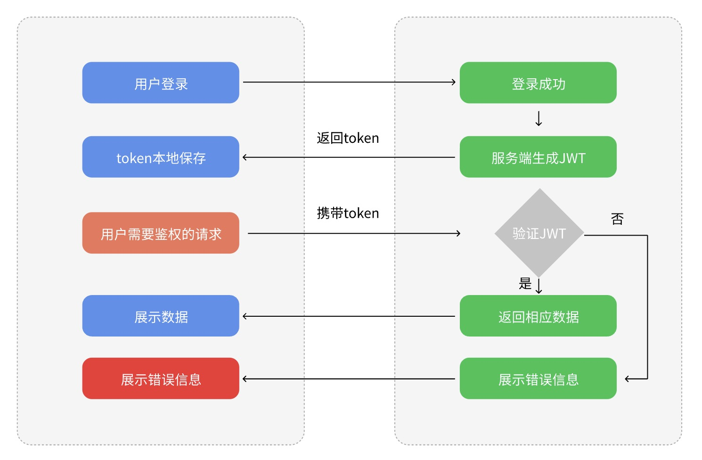
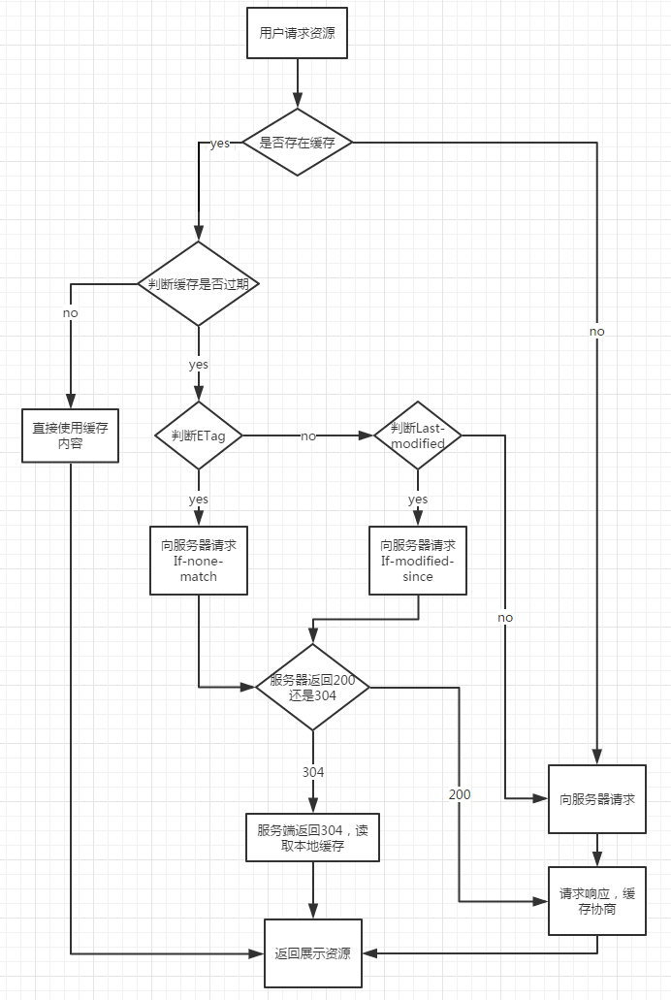
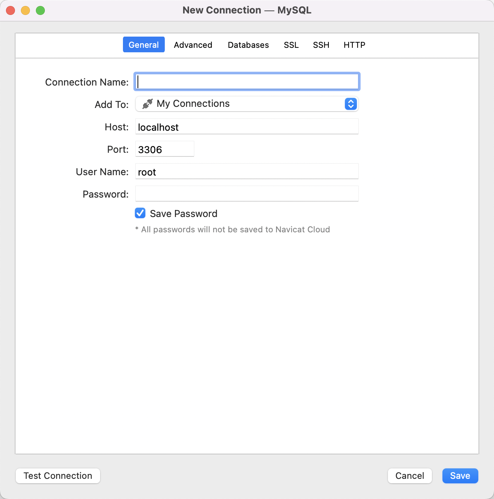

 

### 第一章 从理论到实战-4小时上手koa2专题课程介绍

#### 第一集 从理论到实战-4小时上手koa2专题课程介绍

**简介：零基础到项目实战课程简介**

- 适合人群
  - 前端工程师
  - 后端工程师
  - 测开工程师

- 岗位需求

- 课程大纲速览

- 学后水平
  - 掌握通用nodejs server开发方法
  - 掌握koa中间件原理
  - 掌握koa开发调试方法
  - 掌握RESTFul接口、JWT鉴权等开发标准 
  - 掌握nodemon、pm2的基本使用
  - 能够独立开发小型系统
  
- 项目实战演示

- 学习形式
  - 视频讲解 + 文字笔记 + 代码分析 + 交互流程图
  - 配套源码 + 笔记 + 课程软件 + 技术交流群 + 答疑


#### 第二集 nodejs架构介绍及koa2前生今世

**简介：了解nodejs及koa的由来**

- Node.js是什么？
  基于事件驱动的异步JavaScript运行环境

- Node.js历史线  
  - 2009年5月。由Ryan Dahl开发，使用C++语言编写完成，npm同期诞生
  - 2013年3月，Node.js v0.10 发布
  - 2014年12月，部分开发者不满Node.js的管理发起分裂，
  - 2015年2月，Node.js v0.12发布
  - 2015年9月，Node.js与io.js合并为Node.js v4.0
  - 2016年，Node.js 6发布，Yarn发布
  - ...
  - 2022年10月18日，Node.js 19发布

- Node.js架构
  - Node.js主要由V8、Libuv和第三方库组成。
  - Libuv：跨平台的异步IO库，但它提供的功能不仅仅是IO，还 包括进程、线程、信号、定时器、进程间通信，线程池等。
  - 第三方库：异步DNS解析（cares）、HTTP解析器（旧版使用 http_parser，新版使用llhttp）、HTTP2解析器（nghttp2）、 解压压缩库(zlib)、加密解密库(openssl)等等。
  - V8：实现JS解析和支持自定义的功能，得益于V8支持自定义拓展，才有了Node.js。

- 三大特点
  1. 单线程与多线程
  2. 阻塞 I/O与非阻塞 I/O
  3. 事件驱动
  
- 异步IO例子
  
- ```javascript
  fs.readFile('file', function(err, data){
      // do something
      fs.readFile('xxxx', function(err, data){
          //do something
              fs.readFile('xxxxx', function(err, data){
              // do something
          })
      })
  })
  ```
  
- 


- Koa2的前生今世

  - TJ其人：
    设计师出身，半路出家做了程序员，他一个人完成了express、koa、koa2设计和核心开发
    
    
  - Express：
    - 2010年6月，TJ开始编写Express
    - 2014年发展到v0.12，基本成熟，移交StrongLoop

  - Koa：
    - 2013年8月，TJ开始编写Koa
    - 2015年8月，Koa发布v1.0.0版本
    - 2015年10月，Koa 放弃对 Node v4.0 以下的支持，并用 ES6 重写所有代码，发布 v2.0.0 内测版，后续抛弃掉co，又支持了es7的await/async

  - 一句话介绍express与koa
    - express	web服务框架	es5	回调嵌套
    - koa	web服务框架	es6	Generator函数+yield语句+Promise
    - koa2	web服务框架	es7	async/await+Promise
  
  - 生态的差异
    - express 4.X  weekly downloads: 26,669,573  Unpacked Size: 214 kB
    - koa2 2.X weekly downloads: 1,306,633  Unpacked Size: 93.9KB

    ```js
    // express
    app.use(function (req, res) {
      getUser(user => res.end(user))
    })
    // Koa2
    app.use(async (ctx) => {
      const user = await getUser()
      ctx.body = user
    })
    ```


 

### 第二章 全栈框架koa2环境准备和上手指南

#### 第一集 koa2本地环境准备及中间件基础

**简介：详解koa2本地安装运行，并介绍常用中间件基础**

- npm初始化

- cnpm安装

- koa2安装并配置运行helloworld

- koa2中间件入门

- ```javascript
  // time
  app.use(async (ctx, next) => {
    const start = Date.now();
    console.log('time');
    await next();
    const ms = Date.now() - start;
    console.log('time:', ms);  
  });
    
   // logger
  app.use(async (ctx, next) => {
    const start = Date.now();
    console.log('logger');
    await next();
    const ms = Date.now() - start;
    console.log(`${ctx.method} ${ctx.url} - ${ms}`);
  });
  ```

- 常见中间件介绍及使用

  | 中间件名   | 简介                  |
  | ---------- | --------------------- |
  | koa-router | 服务端路由            |
  | koa-static | 静态文件中间件        |
  | koa-views  | 模版渲染中间件        |
  | koa-body   | 解析 http body 中间件 |
  | koa-logger | 日志中间件            |
  | koa-jwt    | 路由权限控制          |


**koa-router**

```javascript
// 原始代码
app.use((ctx, next) => {
  if (ctx.request.path === '/users') {
    if (ctx.request.method === 'POST') {
      ctx.response.body = "Create User Success~";
    } else {
      ctx.response.body = "Users List~";
    }
  } else {
    ctx.response.body = "Other Request Response";
  }
})

// router
const Koa = require('koa');  // 引入koa框架
const Router = require('koa-router');
const app = new Koa();
const router = new Router();

router.get('/helloworld', async (ctx, next) => {
  ctx.body = 'HelloWorld';
});
app.use(router.routes(), router.allowedMethods());
app.listen(3000);
```


#### 第二集 koa2常用中间件及中间件原理

**简介：详解koa2常用中间件及原理**

**koa-router的其他用法**

请求地址：http://localhost:8000/users/123

路由参数：

```javascript
// 一般形式获取params
const Router = new Router() 
Router.get("/:id", (ctx, next) => {  
  console.log(ctx.params.id);  
  ctx.body = "Hello World"; 
})

// 带路由前缀
const userRouter = new Router({prefix: "/users"}) 
userRouter.get("/:id", (ctx, next) => {  
  console.log(ctx.params.id);  
  ctx.body = "Hello World"; 
})
```


get类型参数:

```javascript
//login?username=why&password=123
const Router = new Router() 
Router.get("/login", (ctx, next) => {  
  console.log(ctx.request.query);  
  ctx.body = "Hello World"; 
})
```


**koa-static**

```javascript
// koa-static
const Koa = require('koa'); 
const Static = require('koa-static');
const path = require('path');

const app = new Koa();
const router = new Router();

router.get('/helloworld', async (ctx, next) => {
  ctx.body = 'HelloWorld';
});
app.use(router);

// http://127.0.0.1:3000/images/favicon.svg
app.use(Static(path.join(__dirname, 'public')))

app.listen(3000);
```


**koa-views**

```html
<!DOCTYPE html>
<html lang="en">
<head>
  <meta charset="UTF-8">
  <meta http-equiv="X-UA-Compatible" content="IE=edge">
  <meta name="viewport" content="width=device-width, initial-scale=1.0">
  <title><%=title%></title>
  <link href="/images/favicon.svg" rel="icon" type="image/x-icon" />
</head>
<body>
  <%=title%>
</body>
</html>
```

```javascript
//koa-views
const Koa = require('koa'); 
const Router = require('koa-router');
const Static = require('koa-static');
const views =  require('koa-views') //https://github.com/tj/consolidate.js#supported-template-engines
const path = require('path');

const app = new Koa();
const router = Router();

app.use(views(path.join(__dirname, './views'), {
  extension: 'ejs'
}))

router.get('/', async (ctx, next) => {
  await ctx.render('index', {
    title: 'hello world',
   })
});

app.use(router.routes(), router.allowedMethods());
app.use(Static(path.join(__dirname, 'public')))
app.listen(3000);
```


**koa-logger**

```javascript
const Koa = require('koa'); 
const Router = require('koa-router');
const Log = require('koa-logger')
const views =  require('koa-views')
const path = require('path');

const app = new Koa();
const router = Router();

// 使用 koa-logger 中间件, 建议在最顶层中间件接入
// str 是一个字符串类型，在发生请求时  str 包含 请求类型、请求路径信息，在发生响应时  str 包含 响应状态码、响应时长、响应文件大小信息。
// args 是一个数组类型，在发生请求时会将请求类型、请求路径放在该数组中，在发生响应时会将响应状态码、响应时长、响应文件大小信息放入该数组中
// 推荐使用log4js
app.use(Log((str, args) => {
  console.log(str);
}))

app.use(views(path.join(__dirname, './views'), {
  extension: 'ejs'
}))

router.get('/', async (ctx, next) => {
  await ctx.render('index', {
    title: 'hello world',
   })
});

app.use(logger({
  transporter: (str, args) => {
    // ...
  }
}))

app.use(router.routes(), router.allowedMethods());
app.listen(3000);
```


#### 第三集 使用postman及其他api测试工具对请求测试

**简介：postman、apifox、apipost7**

**需求**

为什么要用api测试软件

**Postman基本功能**

- 常见类型的接口请求

- 接口响应数据的解析

- 接口管理(Collection)

- 批量执行接口请求

- 日志调试

- 断言

- 变量

- 请求前置脚本

- 接口关联

- 常见的返回值获取

- 生成测试报告

- 代码中发送请求

- 编写接口文档

- mock服务

- 工作空间

  

**竞品对比：**

| 名称     | 产品定位                          | 团队管理 | 文档分享 | 全局cookie/变量 | 自动化测试             | 代码生成 | Api分享平台 |
| -------- | --------------------------------- | -------- | -------- | --------------- | ---------------------- | -------- | ----------- |
| Postman  | Api测试 + Mock                    | &check;  | &check;  | &check;         | &check;                | ---      | ---         |
| Apifox   | Postman + Swagger + Mock + JMeter | &check;  | &check;  | &check;         | 支持多线程并发         | &check;  | &check;     |
| Apipost7 | Postman + Swagger + Mock + Jmeter | &check;  | &check;  | &check;         | 支持多条件组合，无并发 | ---      | ---         |


**响应的多种类型介绍**

- get类型
  
- http://localhost:3000/get?type=1
    - 传递的参数则显示在地址栏，安全性低，参数的长度有限制（2048字符）
    - get请求在刷新浏览器或者回退时无副作用
    - get产生一个tcp数据包
    - get默认会被浏览器缓存

- post类型
    - 更安全，将传递的参数放在request body中
    - 基本认为大小无限制
    - 主流浏览器中，post先发送请求头，再发送请求体，产生两次请求
    - body的多种类型
        - form-data
        - x-www-form-urlencoded
        - json
        - raw

**使用apifox与代码测试多种不同body**

- koa-body的基本介绍
- 使用代码测试koa-body
- apifox测试文件上传

​	

#### 第四集 结合接口测试开发你的第一个jwt鉴权服务

**简介：jwt鉴权服务**

**什么是JWT**

JSON Web Token (JWT)是一个开放标准(RFC 7519)，它定义了一种紧凑的、自包含的方式，用于作为JSON对象在各方之间安全地传输信息。该信息可以被验证和信任，因为它是数字签名的。

**基于JWT的鉴权**

在接受POST请求后，服务端生成一个令牌（token），发放给客户端，客户端在请求时，携带该令牌以证明自己的身份。





**JWT与session的区别**

- JWT不需要存储，而是在服务端根据前端传回的token进行解密比对处理
- session是在用户登录之后，服务端根据用户信息生成sessionId，并返回给客户端，在用户请求时，使用cookie把sessionId传回服务端，服务端基于sessionid去数据库查询，若查到则表示用户还在活跃期，同时也可以获取到存储的必要用户信息。

**JWT鉴权服务的特征**

- 建议使用https协议的POST请求下发token
- 前端每次请求时将JWT放入HTTP Header中（避免XSS和XSRF）
- 不是所有接口都需要JWT校验
- 不需要在服务端保存会话信息，特别适合用于分布式微服务

**需求**

- 提供登陆接口，失败时返回4XX提示，成功时返回用户名等信息，同时向cookie写入token
- 提供信息请求接口，在请求的header中携带token，服务端验证是否拥有访问权限
- 超时验证


```javascript
const Koa = require('koa');
const { koaBody } = require('koa-body');
const path = require('path');
const Router = require('koa-router');
const views =  require('koa-views')
const jwt = require('koa-jwt');
const { sign, verify } = require('jsonwebtoken');

const app = new Koa();
const router = Router();
const secret = 'abcd'

app.use(koaBody({
  multipart:true, 
}));

app.use(views(path.join(__dirname, './views'), {
  extension: 'ejs'
}))

router.use(
  jwt({
    secret,
    cookie: 'token', // 从 cookie 中获取token
    debug: true // 开启debug可以看到准确的错误信息
  })
  .unless({ path: [/^\/public/, '/', '/login', '/list', '/info'] }) // 以 public 开头的请求地址不使用 jwt 中间件
);

router.get('/', async (ctx) => {
  await ctx.render('login', {
    title: 'login',
   })
});

router.get('/list', async (ctx) => {
  await ctx.render('list', {
    title: 'list',
   })
});

function getUserInfo(username){
  return new Promise((resolve) => {
    setTimeout(() => {
      resolve({
        username: 'test',
        pwd: '123'
      })
    },1000)
  })
}

router.get('/info', async (ctx)=>{
  let authorization = ctx.cookies.get('token');
  if(authorization){
    try{
      let res = verify(authorization, secret);
      ctx.body = {
        code: 200,
        data: res
      }
    } catch(err) {
      ctx.body = {
        code: 401,
        data: 'token已失效'
      }
    }
  }else{
    ctx.body = {
      code: 401,
      data: '用户未登录'
    }
  }
})

router.post('/login', async (ctx)=>{
  const res = await (async () => {
    const { username, password } = ctx.request.body;

    const account = await getUserInfo(username);
    if (!account) {
      return {
        message: '用户未找到',
        code: '402',
      }
    }

    if (username === account.username && password === account.pwd) {
      const token = sign({ name: username }, secret, { expiresIn: '3h' }) // token 有效期为3小时

      const userinfo = {
        username: username,
        time: +new Date(),
        token
      };

      return {
        userinfo
      };
    }

    return {
      message: '用户名/密码错误',
      code: '403',
    }

  })()

  if(res.userinfo){
    ctx.cookies.set(
      'token',
      res.userinfo.token,
      {
          domain: '127.0.0.1', // 设置 cookie 的域
          path: '/', // 设置 cookie 的路径
          maxAge: 3 * 60 * 60 * 1000, // cookie 的有效时间 ms
          expires: new Date('2021-12-30'), // cookie 的失效日期，如果设置了 maxAge，expires 将没有作用
          httpOnly: true, // 是否要设置 httpOnly
          overwrite: true // 是否要覆盖已有的 cookie 设置
      }
    )
    ctx.body = {
      username: userinfo.username,
      time: userinfo.time
    };
  }else{
    ctx.body = res
  }
});


app.use(router.routes(), router.allowedMethods());
app.listen(3000);


```


### 第三章 全栈框架koa2进阶之服务端实用知识技巧

#### 第一集 由浅入深上手cookie操作

**简介：cookie基础知识及koa cookie读写**

**cookie是什么？**

- cookie是种特殊的本地存储数据
- cookie由服务器生成，发送给浏览器，浏览器存储到某个文本文件中，下一次请求同一网站时会把该cookie发送给服务器。
- 浏览器对cookie有一定的限制，以确保不会被恶意使用

**cookie诞生的原因**

- 无状态的HTTP协议
- 记录用户状态信息

**格式**

- name/value
- domain
- path
- Expires  +new Date()
- Max-Age
- HttpOnly：设置以后客户端脚本就无法通过 document.cookie 等方式获取
- Secure：设置以后客户端只有 HTTPS 协议下才会发送给服务端

**cookie的限制**

- 同站（相同domain或其父域，同协议、同主机、同端口）cookie可见
- 每个域的cookie的大小限制为4K
- 同域同名cookie会相互覆盖
- path对应地址栏地址，不同path的cookie不同


#### 第二集 所有后端开发必须知道的服务端RESTful规范

**简介：RESTFul规范**

**RESTful是什么？**

REST全称是Representational State Transfer，中文意思是表述（编者注：通常译为表征）性状态转移

**RESTful定义了什么？**

- 协议：api总是使用https

- 域名：尽量让api部署在独有域名下，例如https://api.example.com

- 版本：可以放入URL中，也可以放入请求头中，例如https://api.example.com/v1

- 路径：路径代表资源，因此路径都必须是名词，而且往往与数据库的表名对应，例如https://api.example.com/v1/Users

- 请求方法：

    | 请求方法 | 说明     | 幂等性  | 安全性  |
    | -------- | -------- | ------- | ------- |
    | GET      | 获取资源 | &check; | &check; |
    | POST     | 创建资源 |         |         |
    | PUT      | 更新资源 | &check; |         |
    | DELETE   | 删除资源 | &check; |         |

    安全性 ：不会改变资源状态，可以理解为只读的；

    幂等性 ：执行1次和执行N次，对资源状态改变的效果是等价的。

- 参数：?查询参数，理解成过滤条件，例如：

    ```
    https://api.example.com/v1/users?pageNo=1&pageSize=20
    ```

    

- 状态码：
| 状态码                    | 方法           | 说明                                 |
| ------------------------- | -------------- | ------------------------------------ |
| 200 OK                    | GET            | 服务器成功返回                       |
| 201 CREATED               | POST/PUT/PATCH | 用户新建或修改数据成功               |
| 202 Accepted              | *              | 一个请求已经进入后台排队（异步任务） |
| 204 NO CONTENT            | DELETE         | 用户删除数据成功                     |
| 400 INVALID REQUEST       | POST/PUT/PATCH | 用户发出的请求有错误                 |
| 401 Unauthorized          | *              | 用户没有权限                         |
| 403 Forbidden             | *              | 用户权限通过，但访问是被禁止的       |
| 404 NOT FOUND             | *              | 不存在的记录                         |
| 406 Not Acceptable        | GET            | 用户请求的格式不可得                 |
| 410 Gone                  | GET            | 用户请求的资源被永久删除             |
| 422 Unprocesable entity   | POST/PUT/PATCH | 当创建一个对象时，发生一个验证错误   |
| 500 INTERNAL SERVER ERROR | *              | 服务器发生错误                       |

- 格式：服务端将状态码放入返回json中，字段使用小写字母+驼峰

```javascript
{
  "code": "200", // HTTP响应码
  "status": "success/fail/error",
  "data": 数组/json, 
  "message": ""
}
```


例子：

| 传统                                                        | RESTful                                         |
| ----------------------------------------------------------- | ----------------------------------------------- |
| https://api.example.com/v1/username?id={id}   查询GET       | https://api.example.com/v2/username/{id}    GET |
| https://api.example.com/v1/saveUser    新增POST             | https://api.example.com/v1/user   POST          |
| https://api.example.com/v1/updateUser    新增POST           | https://api.example.com/v1/user   PUT           |
| https://api.example.com/v1/deleteUser?id={id}  删除GET/POST | https://api.example.com/v1/user   DELETE        |


#### 第三集 页面重定向及浏览器缓存配置

**简介：页面重定向及浏览器缓存配置**

**页面重定向**

```javascript
//ctx.redirect(地址)
const Koa = require('koa');
const app = new Koa();
const Router = require('koa-router');
const router = new Router();

router.get('/', async (ctx, next) => {
  ctx.body = 'HelloWorld';
});

router.get('/404', async (ctx, next) => {
  ctx.body = '404';
});

app.use(async (ctx, next) => {
  next();
  if(ctx.status === 404){
    ctx.redirect('/404');
  }
});

app.use(router.routes(), router.allowedMethods());
app.listen(3000);
```


**浏览器缓存配置**

浏览器强缓存与弱缓存



| http请求头名                      | 说明                                                         | 取值                            | http协议版本 | 缓存效果              |
| --------------------------------- | ------------------------------------------------------------ | ------------------------------- | ------------ | --------------------- |
| expires                           | 资源的过期时间，但客户端时间可以任意修改                     | 毫秒时间戳                      | 1.0          | 200(from disk/memory) |
| cache-control                     | cache-control优先级超过expires                               | no-cache、no-store、max-age=0、 | 1.1          | 200(from disk/memory) |
| last-Modified / If-Modified-Since | last-Modified是指资源文件在服务器最后被修改的时间，若last-Modified大于If-Modified-Since，则返回资源，否则走304缓存 |                                 |              | 304 Not Modified      |
| Etag / If-None-Match              | 由服务器为每一个资源生成的唯一标识串，只要资源有变化就这个值就会改变 |                                 |              | 304 Not Modified      |

```javascript
response.set('expires', '' + new Date(Date.now() + 24 * 60 * 60 * 1000))

response.set('cache-control', 'no-cache')

response.set('last-modified', new Date().toUTCString())

response.set('etag', ...)
         
request.headers['if-none-match'] === ...
```

```javascript
router.get(/\S*\.(svg)$/, async (ctx, next) => {
  const { request, response } = ctx;
  const ifNoneMatch = request.headers['if-none-match'];
  const hash = crypto.createHash('md5');
  const favicon = fs.readFileSync(path.resolve(path.join(__dirname, 'public'), `.${ctx.path}`))
  hash.update(favicon);
  const etag = `"${hash.digest('hex')}"`;
  if (ifNoneMatch === etag) {
      response.status = 304;
  } else {
      ctx.type = 'image/svg+xml';
      response.set('etag', etag);
      ctx.body = favicon;
  }

  ctx.set('Cache-Control', 'no-cache');
  await next();
});
```


#### 第四集 mysql数据库从零开始上手指南

**简介：mysql数据库入门介绍及基本使用**

**数据库分类**

数据量和事务型数据库

- SQL，关系型数据库，带有事务性，数据库事务必须具备ACID特性(Atomic原子性，Consistency一致性，Isolation隔离性，Durability持久性)。优点是二维表格，理解起来容易，但处理的数据不能太庞大。比如 MySQL，Postgre，Oracle

- NoSQL，非关系型数据库，泛指非关系型的、分布式的数据库，没有事务特性，NoSQL数据库去掉关系数据库的关系型特性。数据之间无关系，这样就非常容易扩展。大数据量，高性能，NoSQL数据库都具有非常高的读写性能。 比如 MongoDB，Redis

- NewSQL，是对各种新的可扩展/高性能数据库的简称，这类数据库不仅具有NoSQL对海量数据的存储管理能力，还保持了传统数据库支持ACID和SQL等特性，同时带有事务性。比如 OceanBase，TiDB


数据库按行列分类

- 数据是以行，一个record记录的，是行数据库。数据是按列存储的，是列数据库。

- 行数据库，比如 MySQL，Postgre，MongoDB，VoltDB，时序数据库 influxDB 也是行数据库，但有点特殊。

- 列数据， 比如 Cassandra，Hbase


从数据库处理事务的类型，也可以分成三类：OLAP / OLTP / HTAP

- 联机事务处理OLTP（on-line transaction processing）
  OLTP是传统的关系型数据库的主要应用，主要是基本的、日常的事务处理，例如银行交易。

- 联机分析处理OLAP（On-Line Analytical Processing）
  OLAP是数据仓库系统的主要应用，支持复杂的分析操作，侧重决策支持，并且提供直观易懂的查询结果。

- HTAP（Hybrid Transaction AnalyticalProcessing）
  HTAP是数据库技术领域的新名词，是在线事务（On-Line Transaction Processing）和在线分析（Online AnalyticalProcessing）合称简写。即（HTAP=OLAP +OLTP）,既可以在线交易事务，又可以在线实时分析。


**Mysql入门**

**安装**

- 还没下载的话请前往[官网下载](https://dev.mysql.com/downloads/mysql/)，根据提示安装即可

- 也可以通过homebrew安装

  ```javascript
  homebrew install mysql
  
  //设置及修改密码
  mysql_secure_installation
  
  //mac配置环境变量
  vim ~/.zshrc
  export PATH=${PATH}:/usr/local/mysql/bin
  
  //重置密码
  //mac其他方式安装的mysql也可能在local下
  cd /usr/local/Cellar/mysql/8.0.6/bin
  mysql -uroot -p
  ALTER USER 'root'@'localhost' IDENTIFIED BY '新密码';
  ```


**Navicat连接mysql**




**mysql字段类型**

常用的字段类型大致可以分为**数值类型**、**字符串类型**、**日期时间类型**三大类

| 类型      | 大小        | 范围（有符号）/ 格式     | 范围（无符号） | 用途       |
| --------- | ----------- | ------------------------ | -------------- | ---------- |
| tinyint   | 1字节       | -128 - 127               | 0 - 155        | 小整数值   |
| int       | 4字节       | -2147483648 - 2147483647 | 0 - 4294967295 | 大整数值   |
| char      | 0-255字节   |                          |                | 定长字符串 |
| varchar   | 0-65535字节 |                          |                | 变长字符串 |
| text      | 0-65535字节 |                          |                | 长文本     |
| timestamp | 4字节       |                          |                | 时间戳     |
| datetime  | 8字节       | YYYY-MM-DD hh:mm:ss      |                | 日期和时间 |


**关键名词**

主键

用来标识每一行的唯一字段，一个表中只能有唯一一个主键，不接受空值

DDL

数据定义语言，CREATE、ALTER、DROP

DML

数据库操作语言，SELECT、UPDATE、INSERT、DELETE


node连接mysql

```javascript
var mysql      = require('mysql');
var connection = mysql.createConnection({
  host     : 'localhost',
  user     : 'me',
  password : 'secret',
  database : 'my_db'
});
 
connection.connect();
 
connection.query('select * from users', function (error, results, fields) {
  if (error) throw error;
  console.log('The solution is: ', results);
});

connection.end();
```


```javascript
const mysql = require('mysql')
const database = {
  host: 'localhost', // 数据库地址
  port: '3306', // 数据库端口号
  user: 'root', // 数据库登录用户名
  password: '***', // 数据库登录密码
  database: 'learning' // 数据库名称
}
const pool = mysql.createPool({
  host: database.host,
  port: database.port,
  user: database.user,
  password: database.password,
  database: database.database,
  connectionLimit: 10
})

const query = function (sql, values) {
  return new Promise((resolve, reject) => {
    pool.getConnection(function (err, connection) {
      if (err) {
        resolve({
          code: 500,
          msg: `数据库连接失败:${err}`
        })
      } else {
        connection.query(sql, values, (err, results) => {
          if (err) {
            // reject(err)
            resolve({
              code: 400,
              msg: '语句错误：' + err
            })
          } else {
            resolve({
              code: 200,
              data: results
            })
            connection.release() // 连接池释放
          }
        })
      }
    })
  })
}


// 请求
router.post('/v1/list', async (ctx, next) => {
  const sql = 'select * from users'
  const res = await query(sql)
  ctx.body = res
})
```


#### 第五集 nodemon/pm2进程守护

**简介：使用nodemon/pm2保护你的进程**

**nodemon**

- 自动重新启动应用程序。

- 检测要监视的默认文件扩展名。

- 默认支持 node，但易于运行任何可执行文件，如 python、ruby、make 等。

- 忽略特定的文件或目录。

- 监视特定目录。


```javascript
// 安装
npm i -g nodemon

// 监控指定文件
nodemon app.js

// 监控指定目录./utils
nodemon --watch utils

// 监控指定扩展名
nodemon -e js,ts

// 忽略指定文件或目录，支持引号内通配符
nodemon --ignore utils/index.js --ignore 'package/*.js'


// 使用nodemon的events勾子
// events 表示 nodemon 运行到某些状态时的一些触发事件，总共有五个状态：
// start：子进程（即监控的应用）启动
// crash：子进程崩溃，不会触发 exit
// exit：子进程完全退出，不是非正常的崩溃
// restart：子进程重启
// config:update：nodemon 的 config 文件改变
nodemon({ script: 'app.js' }).on('start', function () {
  console.log('nodemon started');
}).on('restart', function () {
  console.log('restart ----');
});

// force a restart
nodemon.emit('restart');

// force a quit
nodemon.emit('quit');
```

**pm2**

- 日志管理；两种日志，pm2系统日志与管理的进程日志，默认会把进程的控制台输出记录到日志中；
- 负载均衡：PM2可以通过创建共享同一服务器端口的多个子进程来扩展您的应用程序。这样做还允许以零秒停机时间重新启动应用程序。
- 终端监控：可以在终端中监控应用程序并检查应用程序运行状况（CPU使用率，使用的内存，请求/分钟等）。
- SSH部署：自动部署，避免逐个在所有服务器中进行ssh。
- 静态服务：支持静态服务器功能

```javascript
// 命名进程
pm2 start app.js --name my-api 

// 后台运行pm2，启动4个app.js进程
pm2 start app.js -i 4

// 查看进程
pm2 list

// 停止进程
pm2 stop all | [app_id]

// 重启进程
pm2 restart all | [app_id]

// 监视所有进程
pm2 monit

// 查看日志
pm2 logs
pm2 log [app_id] # 查看日志
```


**常用配置项说明**

```javascript
name：应用程序名称；
cwd：应用程序所在的目录；
script：应用程序的脚本路径；
log_date_format： 指定日志日期格式，如YYYY-MM-DD HH：mm：ss；
error_file：自定义应用程序的错误日志文件，代码错误可在此文件查找；
out_file：自定义应用程序日志文件，如应用打印大量的标准输出，会导致pm2日志过大；
pid_file：自定义应用程序的pid文件；
interpreter：指定的脚本解释器，如node的不同版本；
interpreter_args：传递给解释器的参数；
instances： 应用启动实例个数，仅在cluster模式有效，默认为fork；
min_uptime：最小运行时间，这里设置的是60s即如果应用程序在60s内退出，pm2会认为程序异常退出，此时触发重启max_restarts设置数量；
max_restarts：设置应用程序异常退出重启的次数，默认15次（从0开始计数）；
autorestart ：默认为true, 发生异常的情况下自动重启；
cron_restart：定时启动，解决重启能解决的问题；
max_memory_restart：最大内存限制数，超出自动重启；
watch：是否启用监控模式，默认是false。如果设置成true，当应用程序变动时，pm2会自动重载。这里也可以设置你要监控的文件。
ignore_watch：忽略监听的文件夹，支持正则表达式；
merge_logs： 设置追加日志而不是新建日志；
exec_interpreter：应用程序的脚本类型，默认是nodejs；
exec_mode：应用程序启动模式，支持fork和cluster模式，默认是fork；
autorestart：启用/禁用应用程序崩溃或退出时自动重启；
vizion：启用/禁用vizion特性(版本控制)；
env：环境变量，object类型；
force：默认false，如果true，可以重复启动一个脚本。pm2不建议这么做；
restart_delay：异常重启情况下，延时重启时间；
```


**pm2 启动模式 fork 和 cluster 的区别**

fork模式，pm2默认用fork模式启动

- 可以修改exec_interpreter，常用于多语言混编，比如php、python等。
- 不支持端口复用，需要自己做应用的端口分配和负载均衡的子进程业务代码。


cluster模式，

- 多实例多进程
- 不可以修改exec_interpreter，只支持node
- 端口可以复用，0代码实现负载均衡


### 第四章 全栈整合案例之简易后台系统开发实战

#### 第一集 整合案例学习目标

**简介：介绍整合案例的学习目标**

目标：

- 掌握jwt模式开发用户登录

- 初步学习基于角色的用户权限控制（RBAC）

- 了解基于crypto-js的密码加密解密入库


**常见的权限设计控制模型**

自主访问控制(DAC)：传统的Linux访问控制方式。资源所有者负责管理访问控制权限，并通过ACL(权限控制列表)管理非所有者权限

强制访问控制(MAC)：安全策略由安全策略管理员集中控制，用户无权覆盖策略

基于角色的访问控制(RBAC) 


**RBAC（RBAC0）**

对系统操作的各种权限不是直接授予具体的用户，而是在用户集合与权限集合之间建立一个角色集合。每一种角色对应一组相应的权限。一旦用户被分配了适当的角色后，该用户就拥有此角色的所有操作权限。

这样做的好处是，简化用户与权限的关系，易于扩展和维护。


**加密**

crypto-js是一个JavaScript的加解密的工具包。它支持多种的算法：`MD5、SHA1、SHA2、SHA3、RIPEMD-160` 哈希散列，进行 `AES、DES、Rabbit、RC4、Triple DES` 加解密。

**AES**

`AES`密码学中的高级加密标准（Advanced Encryption Standard，AES），又称Rijndael加密法，是美国联邦政府采用的一种区块加密标准。这个标准用来替代原先的DES（Data Encryption Standard），已经被多方分析且广为全世界所使用。


#### 第二集 数据库设计及接口设计

**简介：设计数据库及接口**

**数据库**

- users  用户表

- menu  菜单表

- role  角色表

- rule_menu  角色菜单表，记录角色所拥有的菜单id

- operational  运营数据表

- performance   性能数据表


**接口**

| 接口名           | 接口描述         | 类型 | 参数                                  | 返回                                                         |
| ---------------- | ---------------- | ---- | ------------------------------------- | ------------------------------------------------------------ |
| /login           | 用户登录接口     | POST | { username: string, password: string} | { code: number, data: { id: string , birthday: date, email: string, role: number, sex: number, username: string} } |
| /logout          | 用户登出接口     | POST | /                                     | { code: number, data: null }                                 |
| /info            | 获取当前用户信息 | GET  | /                                     | { code: number, data: { id: string , birthday: date, email: string, role: number, sex: number, username: string} } |
| /menuList        | 获取菜单列表     | GET  | /                                     | {code: number, data: [{  id: number, name: string }]         |
| /operationData   | 获取运营数据     | GET  | /                                     | {code: number, data: { uv: number, pv: number ...}           |
| /performanceData | 获取性能数据     | GET  | /                                     | {code: number, data: { loadTime: number... }                 |


#### 第三集 架构及接口代码开发

**简介：目录、架构及代码开发**

项目目录结构

```
mini-site
├─.env
├─app.js
├─config.js
├─package-lock.json
├─package.json
├─router.js
├─src
|  ├─views
|  |   ├─index.ejs
|  |   └─login.ejs
|  ├─service
|  |    ├─index.js
|  |    ├─menu.js
|  |    ├─operational.js
|  |    ├─performance.js
|  |    └─user.js
|  ├─helps
|  |   ├─crypto.js
|  |   └─mysql.js
|  ├─controller
|  |     ├─index.js
|  |     ├─menu.js
|  |     ├─operational.js
|  |     ├─performance.js
|  |     └─user.js
├─public
|   ├─upload
|   └─images
        └favicon.svg
```


**部分新增的npm包**

- dotenv
- mysql
- crypto-js


**后续改进点**

- 数据库orm工具
- 合并router与controller
- service更具结构化
- 功能上需要更多补充
- 多环境
